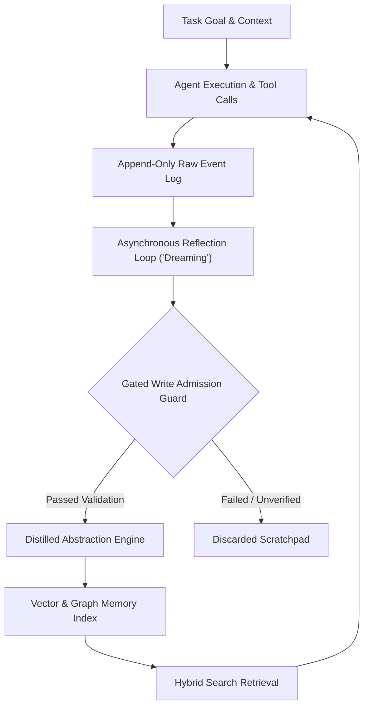

# Repeated Self-Improvement via Output Indexing in Autonomous AI Agents

> **Note for Beginners:** Imagine keeping a detailed log of every mistake, success, and strategy you encounter while learning a complex domain. Instead of relying on raw memory, you organize your notes into actionable rules, verify them against real test runs, and review the relevant strategies before tackling a new challenge. In AI engineering, this pattern is called self-improvement via output indexing—where autonomous agents record, distill, and retrieve their past outputs to continuously optimize performance without retraining their underlying language models.

## 1. Architectural Foundations and Taxonomies of Agent Memory

Modern autonomous agent designs follow the *Cognitive Architectures for Language Agents* (CoALA) framework (Sumers et al., Princeton, 2023). Under CoALA, agent state is partitioned into four functional stores:
*   **Working Memory:** The active context window containing current prompt instructions and active variables.
*   **Episodic Memory:** A time-stamped record of past interaction sequences, environment observations, and execution outcomes.
*   **Semantic Memory:** A repository of decontextualized facts, world knowledge, and entity relationships.
*   **Procedural Memory:** A library of executable rules, code tools, and operational workflows.

Early agent architectures logged raw environment interaction streams—such as full Document Object Model (DOM) trees or verbose API payloads—directly into vector stores. However, raw trajectory logging introduced severe "storage bloat" and "context noise," where irrelevancies in past logs polluted the agent's context window during retrieval.

Modern consensus favors transforming raw execution streams into high-level abstractions (such as modular code scripts, verbal reflection summaries, or structured heuristic notes) before indexing. To protect operational latencies, production pipelines isolate real-time task execution from memory consolidation through an asynchronous "dreaming" phase.



During execution, intermediate steps write to immutable, append-only stores (such as SQLite, Postgres, or RocksDB Write-Ahead Logs). Upon task completion or external feedback, an asynchronous background reflection process evaluates the trajectory, isolates key decision points, extracts distilled lessons, and routes validated abstractions into the primary index.

---

## 2. Framework Mechanics: Indexing Substrates Across State-of-the-Art Systems

Agent frameworks handle output indexing, retrieval scope, and feedback processing differently depending on their target domain.

| Framework | Indexed Substrate | Storage / Index Type | Retrieval Procedure | Scope & Self-Improvement Loop |
| :--- | :--- | :--- | :--- | :--- |
| **Voyager** | Executable JavaScript tool functions (Mineflayer API) | Key-value store backed by Chroma vector database | Dense vector similarity (`text-embedding-ada-002`) of goal to function docstrings (Top-$k$, $k=5$) | Cross-task lifelong learning in open-ended environments via iterative code synthesis and execution feedback. |
| **Reflexion** | Natural language verbal reflection summaries | In-memory FIFO queue / sliding window buffer | Sequential / in-context direct prompt concatenation | Short-term episode-level correction using Actor, Evaluator, and Self-Reflection LLM loops. |
| **ReasoningBank** | Structured strategy items (Title, Scope, Heuristic Content) | Global vector memory pool using dense embeddings | Cosine semantic similarity matching task prompt to strategy heuristics | Cross-task test-time evolution driven by dual-prompt extraction across wins and losses. |
| **MemoryBank** | Summarized conversation and action episodes | Vector database with dynamic Ebbinghaus decay functions | Dense vector similarity adjusted by recency, frequency, and importance weights | Long-term memory retention with automatic forgetting of low-signal operational noise. |
| **AgentBank** | Offline SFT training dataset (50k+ interaction traces) | Static disk storage for model fine-tuning | Non-retrieved static training corpus | Offline weight tuning (e.g., Samoyed models) rather than active online agent indexing. |

While systems like *Voyager* transform experiences into executable code skills and *ReasoningBank* extracts structured decision rules, frameworks like *Reflexion* operate strictly within short-term prompt context. Distinguishing active indexing engines from static SFT datasets like *AgentBank* highlights the design difference between non-parametric memory retrieval and parameter weight optimization.

---

## 3. Vector Indexing, Storage Architectures, and Retrieval Engineering

Scaling an agent's memory to tens of millions of historical outputs requires specialized indexing structures and search algorithms:

### Pre-Scan Metadata Payload Filtering in HNSW Graphs
Hierarchical Navigable Small World (HNSW) graphs organize vectors into proximity networks for fast approximate nearest neighbor (ANN) search. However, querying raw vector stores without filtering returns irrelevant trajectories across non-matching tasks. Modern production stores (such as Qdrant and Weaviate) enforce pre-scan metadata payload filtering. By restricting candidate nodes using structured parameters (`agent_id`, `domain`, `validation_status`) *prior* to graph traversal, systems eliminate post-filtering overhead—reducing p99 retrieval latencies at 10 million vectors from 100–300 ms down to 26–29 ms.

### Memory Optimization via Vector Quantization
Storing millions of execution vectors in raw 32-bit floating-point format consumes prohibitive memory. Implementing Binary Quantization (BQ) or Scalar Quantization (SQ) compresses vector footprints by up to 32x. This enables systems to store 10 million scratchpad and execution vectors in approximately 1.3 GB of RAM with minimal degradation in recall accuracy.

### Hybrid Search Fusion
Dense semantic embeddings often fail when searching for precise error codes, exact tool parameter keys, or stack traces. Systems combine dense vector models (e.g., Voyage-3 or OpenAI `text-embedding-3`) with sparse lexical indexes (BM25 or SQLite Full-Text Search FTS5). Search hits from both channels are merged using Reciprocal Rank Fusion (RRF):

$$RRF\_Score(d) = \sum_{m \in M} \frac{1}{k + r_m(d)}$$

where $r_m(d)$ is the rank of document $d$ in retrieval model $m$, and $k$ is a smoothing constant (typically set to 60).

### Multi-Dimensional Contextual Retrieval
Rather than retrieving memories solely based on user query similarity, agents construct query vectors combining four distinct contextual dimensions:
1. Current high-level task goal description.
2. Active environment state and tool configuration.
3. Structural execution step pattern.
4. Historical failure mode or error signature.

### Dual-Layer Memory Architectures
Architectures like *Structured Episodic Event Memory (SEEM)* split storage into a static Graph Memory Layer (organizing relational domain entities) and a Dynamic Episodic Memory Layer (organizing Episodic Event Frames with provenance pointers to raw logs). Similarly, Temporal Knowledge Graphs (such as Graphiti and Zep) establish validity windows ($T_{\text{start}}$ to $T_{\text{end}}$) to handle fact invalidation—ensuring that if an agent learns a revised tool schema, old parameters are marked invalid while preserving full historical auditability.

```
[Industry Architectural Divergence]
├── Production Vector Stores (Qdrant, Weaviate): HNSW + Pre-filtering + Quantization + Hybrid RRF
└── File-Based & FTS Systems (Claude Code, Hermes Agent): Local structured flat files + BM25/FTS5 (Bypassing Vector DBs)
```

---

## 4. Empirical Benchmark Performance and Systemic Failure Modes

Indexing self-generated outputs drives measurable gains across benchmarks, but introduces critical failure modes when outputs are ingested without verification.

### Empirical Performance Gains
*   **Software Engineering:** The *Darwin Gödel Machine (DGM)*—a self-modifying code framework—boosted SWE-bench solve rates from 20.0% to 50.0% and Polyglot rates from 14.2% to 30.7%. The runtime scaffold *Live-SWE-agent* reached 75.4% on SWE-bench Verified and 45.8% on SWE-bench Pro by modifying its execution tools on the fly. Non-gradient self-improving coding agents achieved performance jumps of +17% to +53% on SWE-bench Verified subsets.
*   **Instruction Alignment & Reasoning:** *Self-Rewarding Language Models* (using LLM-as-a-Judge and Iterative Direct Preference Optimization on Llama 2 70B) achieved AlpacaEval 2.0 scores outperforming Claude 2 and GPT-4 (0613). *Temporal Self-Rewarding Models* attained a 29.44% win rate on AlpacaEval 2.0.
*   **Reflexion & Multi-Agent Systems:** Incorporating verbal reflections increased GPT-4 HumanEval accuracy from 80% to 91% (and GPT-3.5 from 67% to 88%), while reaching 97% on ALFWorld and 51% on HotPotQA. Decoupling roles via *Multi-Agent Reflexion (MAR)* further boosted HumanEval pass@1 from 76.4% to 82.6%.

### Systemic Failure Modes and Risks
*   **Model Collapse and Autophagy:** Training or prompting models recursively on unverified self-generated data causes structural distribution shifts. *Early collapse* erases rare edge-case knowledge ("tail information"), while *late collapse* contracts model outputs into low-diversity, repetitive point masses. In clinical agents, this "autophagy" causes interpretative drift, homogenizing rare pathological conditions into benign population averages.
*   **The Error Avalanche:** In ungrounded feedback loops, small reasoning errors in indexed reflections compound exponentially over successive runs. This triggers sudden performance cliffs where agent accuracy drops precipitously after initial gains.
*   **Single-Agent Confirmation Bias:** Asking a single model to evaluate its own outputs creates statistical confirmation bias, leading the model to endorse its own hallucinations and index them as factual strategies.
*   **RAG Memory Contamination & Synthetic Traps:** When agents auto-ingest unverified summary notes into vector databases, retrievers preferentially surface this dense synthetic content. This forms a hallucination feedback loop, degrading long-term output quality.
*   **Metaproductivity-Performance Mismatch:** Optimizing agents purely for short-term task metrics can cause them to specialize in narrow prompt patterns while degrading their underlying generalization capacity.

---

## 5. Lifecycles, Write Admission, Decay, and Mitigation Strategies

Preventing memory contamination requires strict governance protocols across the memory lifecycle:

```
[Raw Event Stream] ──> [Deterministic Oracle / Verification] ──> [Gated Write Admission] ──> [Exponential Decay Filter] ──> [Episodic Memory]
```

### Gated Write Admission
Agents are prohibited from writing raw intermediate scratchpad steps directly into long-term vector indexes. Outputs are routed to temporary buffers and injected into long-term index databases only after meeting strict admission criteria:
1.  **Deterministic Verification:** Execution passing unit tests, syntax compilation, or sandbox assertions.
2.  **Multi-Voter Consensus:** Rejection sampling or majority voting across decoupled agent nodes.
3.  **Explicit Environment Rewards:** Positive signals returned by external API state checks.

### Dynamic Memory Decay Algorithms
To prevent legacy strategies from clogging context windows, systems apply time-weighted decay functions:

$$S_{\text{effective}} = S_{\text{cosine}} \times e^{-\lambda \Delta t}$$

where $\lambda$ represents the decay constant and $\Delta t$ is the elapsed time or operational step count. Frameworks like SAGE utilize Ebbinghaus forgetting curves to drop operational noise ("checked status", "compiled code") while preserving high-signal strategic rules.

### Core Architectural Mitigations
*   **Deterministic Execution Oracles:** Replacing LLM self-evaluations with objective ground truth (compilers, unit test suites, execution sandboxes).
*   **Multi-Agent Decoupling:** Separating execution (Actor), diagnosis (Critic), and verification (Judge) across isolated model instances to eliminate confirmation bias.
*   **Real-Data Anchoring ("Human Vaults"):** Injecting human-verified ground-truth trajectories into vector indexes alongside synthetic data to preserve distributional tails and prevent model collapse.

---

## Mini-glossary

*   **CoALA Taxonomy:** A framework defining the cognitive components of AI agents (Working, Episodic, Semantic, and Procedural memory).
*   **Episodic Memory:** A temporal database storing time-stamped logs of an agent's past execution sequences, decisions, and environment responses.
*   **Pre-Scan Metadata Payload Filtering:** Filtering candidate vector records by structured payload attributes before traversing HNSW graphs, eliminating latency overhead during retrieval.
*   **Binary / Scalar Quantization (BQ/SQ):** Compression techniques that downsample high-precision 32-bit floating-point vector embeddings into low-bit representations to reduce RAM usage.
*   **Reciprocal Rank Fusion (RRF):** An algorithmic method for combining ranked search results from separate dense vector and sparse lexical retrieval channels into a unified score.
*   **Model Collapse:** A degenerative degradation process where generative models trained recursively on unverified synthetic data lose tail distribution diversity and contract into repetitive outputs.
*   **Error Avalanche:** Exponential compounding of unverified self-generated errors in agent memory buffers, causing performance cliffs over iterative runs.
*   **Gated Write Admission:** Security and quality control policies that block unverified agent outputs from entering long-term memory indexes until validated by external tests or oracles.
*   **Synthetic Information Field Trap:** A retrieval failure mode where vector search preferentially retrieves unverified synthetic summaries over raw ground truth due to semantic density alignment.

## References
- [arxiv.org](https://vertexaisearch.cloud.google.com/grounding-api-redirect/AUZIYQH4gjPTNNXQqNSmLj6Vxm-rblXHUqdiqt8H_SyNw4LLI3dcrdxVqsYH-dRCA99Bf1Z9A1GdSlkS83Gk4s_EcNQEChPOnDOqaKi4dxT0-WEDm1MOvusbQw==)
- [minedojo.org](https://vertexaisearch.cloud.google.com/grounding-api-redirect/AUZIYQGcGNtBlTrW03AMWThLwiNoEDzc9u691iwqk9T7sXxvbQswWRtr3USXRTz4x3kNYIWrtQRGdimfx-KxNmLIKsN2Ws2kSEggviC2rb_5XelBV7UU_sb_6sVubbO7sOg2EeI8VGszTUenimMO1vojXrk=)
- [tistory.com](https://vertexaisearch.cloud.google.com/grounding-api-redirect/AUZIYQHOl54kMu5mRXq8Ur2ULJw0q1nIW2DbXXALDIH4db8fNOHy9CUmm6DgrkSf8QZ9ta9H_WTBzybKhuOjQC2LIjS0yq0qDDiw9vZq733fbgBAnqKlNls=)
- [arxiv.org](https://vertexaisearch.cloud.google.com/grounding-api-redirect/AUZIYQEjmSDysKsLaHnJSubECnDSJMjP4qYlF2ZDZKCoWZuPjklxqv_zGY8xCELUwCZUGCWeNVOv2MXH_71_CMDHXEAiogztXii5vltrWQRzpZfYSHFLlzj7YCM=)
- [aclanthology.org](https://vertexaisearch.cloud.google.com/grounding-api-redirect/AUZIYQEBuMEVpil3yVATCj0eJQQ7Opc_EKrn8_plL1NhSVVB4m10QRozqoOOh39GOlJtoYeswk7nYXPlwdjaypMLOIbH9sFzZHxFcpSv0J-b-q9VyJxhbgZoQ3ePYk1pfLXvjDyqf-nIn562qxno)
- [arxiv.org](https://vertexaisearch.cloud.google.com/grounding-api-redirect/AUZIYQH1jOoQoTBd-ZQo1_opcltFzDA4f2ATG0VKASF0T1EdeHWO7PZZ8bSlD4uYF2f2pKLbr0BDzmzeY8uvRTEQyqO38USb2rF-DZfAzuBxt6skn8WFveIipw==)
- [github.com](https://vertexaisearch.cloud.google.com/grounding-api-redirect/AUZIYQEEA6_EDfB6vwSWCeR4CjTxLZRSmb6zG8Fr8PuimPJyvINwrtAFxB-_WLPF4y5yrogMGgZCxNde_LA9lfc5nicnhDtKcZEkzMLgLrBEoJY1PgU5EMbrmrF60vqeNw==)
- [bayjarvis.com](https://vertexaisearch.cloud.google.com/grounding-api-redirect/AUZIYQHswD6LJABpcQYygRlE8T5ECGBuvZnN_bHqSQmULUvmVFLZCoJGo_I9SkeFKQBpfEi2H5A24EUvGtIfexCrANoEK5LFeEzjkqMeP1lLPfheKigqCQvgAWEEtieq6qTcrvX0BUNWBTdDF1AcVbQnZMvzBzIMfFSqUg6eeqw0gr6EEwfG1pHCeEAfSX6LGraVRCrtF7A=)
- [youtube.com](https://vertexaisearch.cloud.google.com/grounding-api-redirect/AUZIYQH4ZnKhfKEhAFch-UoMw0_r8gdE7GSdy2qVhA7Hmt0UhgB_jw87zXP6oMVSNYtPDRuqqdx3NjXkM9BXylU8PbA7bbUWxacWICr7Fgj-dV-_ruHMRgaG0CL5lLw6WqWIV4kp)
- [arxiv.org](https://vertexaisearch.cloud.google.com/grounding-api-redirect/AUZIYQHap0Ayawupzq-xf9PbGwUZw1sNbuHJMzYZrjscYHh--9K3VjcS5AwMipj0hOHraQ2vP0_1ikGmmaTSpI6K5TXPe8zt4BdIiNg97paYWkNd9GGQ7-Fkug==)
- [openreview.net](https://vertexaisearch.cloud.google.com/grounding-api-redirect/AUZIYQEFf50Z5_fOjYgstc4HXXbQirOewthUxfAtZDAMUV3RW-d398EyVKI-Eofcs-LFqXXH6YTyhjj6Y1UkMc14ybVb6wOCqhAeh_D1PHkmpMNHSvN_hnME7wLyn5llD4rd)
- [medium.com](https://vertexaisearch.cloud.google.com/grounding-api-redirect/AUZIYQE-pBr-APelQFD77N8AK2MWq8f1g61KUDAoEwA9xSTMwdABDLL0suuqFLs6HkmXKqEIGS4k7RXDRFkaLkUUFEv6i3s_uHAEaOTZpD7OexoMpDbrl4jJ8mBQHsiSjF9ghoWu4qDkPtOcIDXPdB8RDrLcC0IKLcvXAh9sD6kJTj8dZ2S3K4FdJmp32XH-VAyMvHhJzw5T7lzg92ral4ViLqNybDTpDNg7aOhWaAS3TanH1iEjpT6Ruuj9Os_N8BEyQQ==)
- [openreview.net](https://vertexaisearch.cloud.google.com/grounding-api-redirect/AUZIYQGjQSFTRorLb2YXZQ7c7YNdBqb0g7amp03jHhFIBAYoB4rc9qstD1hANTzZHBZRESW959QmAWWwC25smX-Fsop6pz0JFUpjR5HIfCw3REhYGWyl3IqxOE80Ibs_nAUOi3_RdE0KKJr1WoxOxM675vsXF5h1QuQWNKTore6i1w==)
- [researchgate.net](https://vertexaisearch.cloud.google.com/grounding-api-redirect/AUZIYQFPhR1InySyYG0iKH5u5WPAKXA343EegZs8Z4csoKTAeTqW2kYMX-qlqzc-ih4Wln3g6aNqyTPejPJhJwieToOPllOO-CwaA2GTl6CF39mqw84Q9ZIBrrk-i_clpxj15aOQdzZrx_MYG-XTna0A5YCQHm6JeHXayCSelsfwTLsHhSknJWRs_8H8VK6LB0dPJNIgFzLXG-gKIx6vgjRuxmwIRbflQ1AY)
- [marktechpost.com](https://vertexaisearch.cloud.google.com/grounding-api-redirect/AUZIYQEUpeK7NzMqHvyG0XkbDxjPfMvQwg_hnZ5FVN2JzMU3GZh8mkBTgdxygb61dss_0WpsmDSOkxm2rZbk-YrTcDDqt4PKMFjNED7NrLgt6PQ6DcLJfXrK8z6hFGACdr_4vDRo2ctOr2Xw29zNTFPJ4EZhrXP9k2jEtyxanRcKsMfTUx6jFXe-2vtP-BaqAk_6kMCxKGV1v2-IcgYl1hV7vA5LcouC8p4cZ_8eVVE06b2pFyFAfMzzr9vf98R0If61ZDtGtRdP0S1EHH57RLCgKL6B4cH9tnhgVbLS)
- [research.google](https://vertexaisearch.cloud.google.com/grounding-api-redirect/AUZIYQFRTPVOR8nVBXQiLyjsCote_5jYrpk-3WCIqmTU4iVWtdWqMbykHpM1RqEFBmr78AEAhNYNjuM7oMGE2Bs2Rxfn4ogCe2fO_PN8m5kI69NbkUPPeKvp3yrG59YLbAPoYSNl9u6peD1kNSSew9E_jnFryBCAUDa67mEN2ScDXrC4ED7GWA8TXYxE6x4=)
- [github.com](https://vertexaisearch.cloud.google.com/grounding-api-redirect/AUZIYQHx6m7_Lk_N3iM0GV1bBS4O2e98e1QsLAnXDocdDMY1joqm3eIbFa0GjClsmj22OaUgQiHDO_fcje_vDc7VCZsrZXt1y-exQGyEeN30TnZzbtC7PJeWTnYN5eM_FdJt)
- [aclanthology.org](https://vertexaisearch.cloud.google.com/grounding-api-redirect/AUZIYQGHHcKN8rlZFDjnIf4F0RLtTvL7pjFFOQk_tiPH8RiQNd0Q0EHU_AY5kLEE0-BqkfaHSSVWXDHoUPF8yiVzYuIyL5j88_XFkEli3Rf0DDlx6zx_zt57NXFIQSTSM3pu_nAZUy0MCfZKLDU=)
- [researchgate.net](https://vertexaisearch.cloud.google.com/grounding-api-redirect/AUZIYQEPx5TR_Zd3YVpe7OZYwv0Ff1uVPk06xuhI3rialfiQDwNFDMuRSWhV-QqvIUeLfnRnA2iMCbk6btuu96SYi2eugkWcNOC4qW4dCWwnBW6P147stYgScCNIvwNU7CWyiqqi5pu-f8vps-wdwlW_T6jQN4VIqL8hh_IGdr4k4TNPpd_CXIcOauJeVjp1VgzUTS7XHVRJPLAjVUcrfTW8loOTZNxnhql_YeB9)
- [alphaxiv.org](https://vertexaisearch.cloud.google.com/grounding-api-redirect/AUZIYQHyfe1dFR70N-PmrbSS5YUsIAUzYxDEzOtHaAT2hIKM7X2BLhbhYjWwAbE3dLBKOdZprQd3rWhbwudmlb3r8rm8f-9n56ZFyEeN5sajOZy-Y2BA20g0IUgMomBm6iQ=)
- [preprints.org](https://vertexaisearch.cloud.google.com/grounding-api-redirect/AUZIYQEUgqBsLkCwzqiwhf9DCuuje3YdVK6Y05v8sSk4ywX1RVhztXd0MVDgIcm3a_fRdQ5UC36IePPLxJdlHs9U31oAvUdRS8RtO9ypNm2YkYMtcRC4tfPzbIP-eE9egUYwTV7l1RCiaOxQtx8DxuzZ1dHeigHHAvoRbIkgfnDs6x-3tGuenaH5Ij9ryfEJjVxtOkvW)
- [medium.com](https://vertexaisearch.cloud.google.com/grounding-api-redirect/AUZIYQH0aLetJDSyANK-3GB21-sm-RJLO_spFggQJEp8wPaeI_E5mxN5N4TXUU1NLq_-TwL89bxvDamo9moMVUqu7lK_4WAhQdFnHopI98kHX5ScL33s5U3r8622CsP7Vdcnw7nDEID-pyIJg9Qfa3bnbUJu1u6tcRx_fyVuvlgswstPffCBIhRxK9-4rMyA0Ris8-hc9MTyIkPDT3FzFSUklZUhzlw=)
- [researchgate.net](https://vertexaisearch.cloud.google.com/grounding-api-redirect/AUZIYQHloCvXf0j0qVGxff4OkmOI3S21fqbBJUaAWTdvut1vJ2ALBOqH2Ya36V5UNxdIFJddG58UUztoKT5xfdKx4ausS8nY_8lu-ugIjVb6OaeodDCrlHIt2Rb5ngiBoCwhRYSNzZYE2H2ekSF4uW4WGe2rhCjh48NbX6Rc0ixgy5_3U_J4JCJm9YiOhjkwfI9Y3yd-qjB5U_w_DrYxRI_tM7J9KArb5vE=)
- [arxiv.org](https://vertexaisearch.cloud.google.com/grounding-api-redirect/AUZIYQFzIVMPLB9EU-kJwMJ7cBZJ6eZBQc4zMAYTtpFvHclB5tVXnZ2b3wDuphl2sg4iea5P2-jK99goMARzk-WY4myBaMCS5vkPOaWfQXdWixQSA041akc5wk1q6g==)
- [arxiv.org](https://vertexaisearch.cloud.google.com/grounding-api-redirect/AUZIYQFR6rHRxX99YLg-a1clxo9hCy1FAiSTkHU3Fcg09m7V9R3Myt6sVe9k5t38UyyAdjBY2aqh-zIyo2JlOXfzxCP5teEA4PRF6-pZB2GZ4jO72PQUIVjHgyPSUQ==)
- [github.com](https://vertexaisearch.cloud.google.com/grounding-api-redirect/AUZIYQELEljRwl4-b0ALqG0yzKC1jSOADLhGZr3QIlyhIP3CaCOPwt0i85Vix0NSrr-I0_oYrBHoi2f1Bgm1vfcaJ1PeJeu1IFIbrycxFDnAKiETiVYiNgVCE4FDEt8zZ7sYFxFXSPgMHK-MOVVRPAn7QIwmnNhD04P0I2X_3PRI)
- [sakana.ai](https://vertexaisearch.cloud.google.com/grounding-api-redirect/AUZIYQHseqRCcYTKMq8JYmuXXuGBWgfgkmXM90LkfJPvHPQuoeXOEKYscQ0vsHS5Lbv7VQRWsD8DsnfuOR-pFJiujZfrMlLtrvhkew_M3xA=)
- [huggingface.co](https://vertexaisearch.cloud.google.com/grounding-api-redirect/AUZIYQFcOH3tnLBQuj6WNwIm7HHghK85gw0DmbRaaMJ3gSg58xldUaGb26aoA-OXYnlfaUAFu3L0EbwYUeQ_pf5Upx5yzA_hr1aa_bmBzXnJNprf6vKLF5rolyMLlcg2W4GFE-fc2dw=)
- [liner.com](https://vertexaisearch.cloud.google.com/grounding-api-redirect/AUZIYQHiBdUf5F0XGHMUcOmlq398m5RRo_NMs9ipI8OrGeOBMJvXs6dXl7n7nKCgW9xhJB9WS_9U6J4FV6pEGBOk0zzk_D2pAduqsl6zLaXWYZdFSPgs6kB94-kgkdpetq7UHNx6EBwgQAvnKEfJd9-zjJQxGSqymMo8PcEnD4_mHNGuyNZm0l0DjSopd9xG4g==)
- [iclr.cc](https://vertexaisearch.cloud.google.com/grounding-api-redirect/AUZIYQEV2RVlKyN9GnylgB8WR602zEnDTg4LpYapwEzUk6ocgXIdZXVBiGlt9Jh9LIYgI9CLqH8PBixytME4lOcsPiTQ-vxIY4l1Gdy8XcCa1fIjR1b6nDdOPDUWsirCDFy_Kg==)
- [arxiv.org](https://vertexaisearch.cloud.google.com/grounding-api-redirect/AUZIYQGcsnAwh42e7TAhxYI0Zx0WxKPoj63qzRXaaCgl5XjeSdHuf0pncNldOCSuqnSQaCQxx0vQZWg1geJvq8j3St3kLq17yrVMkmY7DmQTQjE1WHVEj6v7)
- [arxiv.org](https://vertexaisearch.cloud.google.com/grounding-api-redirect/AUZIYQF2EKri_NxsfthP_5ZXq8wIuN9F9lBHR5ymqOP8Pcf0iX6hnbsf2QN2VkNySLePmokB9Li89oqW8GOXUznrJikENodlJfbFL9WIVx_4FQIuYECdaGvn)
- [arxiv.org](https://vertexaisearch.cloud.google.com/grounding-api-redirect/AUZIYQHfJTRckep5MRaIgft7NlpGcae7Rh07bF-sMjmSwzqIXRKMTi15QAVO6xPV2r78akWox8UqvtPCMuFMjUEE2UFobVRo1GT2p5bKjNU97iFArV1yWz61)
- [reddit.com](https://vertexaisearch.cloud.google.com/grounding-api-redirect/AUZIYQEdJ5uwZMYtJJiEL8NX5LSpPPhCqqJsT5ns7kLWZrVcJzMBNLniCUePp6QkY2RiQ41lG3sDEnUS2NSkrFZti8LnBFpFs4yV2pNpHpSFrmAMsFKQVJ_Cd8SmFGHBo6mAPl1h0mg7KKnxvQpeb5UVGRBdfh-Nea9uGzct-zAHs84o-U8mJ1IpdDpT)
- [arxiv.org](https://vertexaisearch.cloud.google.com/grounding-api-redirect/AUZIYQF86TINDhCgpEvP0jLDiSASxX6xHcZ2kZb3tXC25K-E5K562BMnag1p9NKvFY7i-kZIMRd6XuH0x0evrANMsXuxNwa3NCzPR0MwCjOtDmPeRZs2HSvnikfI)
- [aclanthology.org](https://vertexaisearch.cloud.google.com/grounding-api-redirect/AUZIYQGTs7gIbw_oHLdt2myyFoc3kuQqxyjU7OiaecFJiGLYb5dHCF7dEFcxLugay3OEvZ0Zu4-2AeQ7txkgPRIbHzsCeW0IFLfJTjTo3_qrpVWcMyRZrmeXBlGssuipAL8M4Kj0Ek14dxOs)
- [medium.com](https://vertexaisearch.cloud.google.com/grounding-api-redirect/AUZIYQEE0WJ8W3S1qHZpLwpPqQjmlTY1Z6ZoP95gEuEL1GYNXoDgajcIN5W3bSQpwywJVT0uANF6OgySI48YMSTwm5Pyr8eXc5DgIBv069JZX6uVegwrWctlvwbu0oSqIiF6UvU_yxvfNUFCPYcHmgbWADBGpxM4Wdwk3hYoWKLrS44T26CyuPiUdqm-MiTLQ_NOiITHP0k8YtkToEsv5gAj4gMNksdVyl4OogWwemROXDJVawc6Bp9HAZFwjlgflZRq66WY)
- [reddit.com](https://vertexaisearch.cloud.google.com/grounding-api-redirect/AUZIYQGheWrwcvj6GWpIFnHEPbji92AN-aHvMw55pdFfkJkr2I_HQVF3kLP5AaCM2NUkpgcsmXjtI1hN2WRvFqr_lXFPXQ0YRbQzYKtN11HYZuAYHnZip4mouFniW73ENjc-ZU157CXASMms99uIc1K8QkMJa6T_6ALnkJ3hONMEqi_gZPv1dVghLgTmpY99_7mWmvG8WGhUApluaXFxk-I=)
- [huggingface.co](https://vertexaisearch.cloud.google.com/grounding-api-redirect/AUZIYQHX6x0Q8vAB42cTKjrKlcDUlowCGb15BEKy0cgep5bNKFOHiQ3Y4lI0L6fZMpRfrViTMD0Ve8Ay9PkxijKYNUO1cn0Fs0lw82TCTCPM4A-TcDVTj7vKR_CsS1CgZSo4LjwdLdih)
- [arxiv.org](https://vertexaisearch.cloud.google.com/grounding-api-redirect/AUZIYQHz8Z6L7mr7cOqvOljKQr__rnyDyEcGtlJIVeyfiRnI9qSNSx2LVpa2hq3_mDLh0avFwPOFFbMV9JF-SYrrZerTBOlJZo4Aor7y41PxZGWRxm_eOD8K2858)
- [tistory.com](https://vertexaisearch.cloud.google.com/grounding-api-redirect/AUZIYQFSmCGE_gO54YRoamFzs5yD0ZBkJWnyiD82y6dvHsIHDdNr2uxUsGCNkzVL4T8ZRNS2YCY2IpbGmSOUcZRiHGeECEIrL2pBSSkuHZ-p7nTffAXracQBgMMvKG1OmhxJZkcU2R3tz0FqjOY41iRMPlUwchan0ZMeQrNKkcHBxJnXVumn8oqleNrcacRHo2XMICAZDpyUO6hfUI3H4Za407UdNxpRkT0NsDHYZkU_4H9Tvotm9via2sE5QeWehrP8O6Y=)
- [vinish.dev](https://vertexaisearch.cloud.google.com/grounding-api-redirect/AUZIYQHXWag6dVxDStT7B1lDcl1FDkBJkRaKlGmXjLsojnirPl7oHcea94s08oj7MCzMhK4eWIWWhmMuOuKkltriCDvfxHArAzlI4s84VyFo_30UL72mA-jr1zeuE6w3bFplBKuh-chcaFvalIrzqeXXyQ==)
- [softwareseni.com](https://vertexaisearch.cloud.google.com/grounding-api-redirect/AUZIYQHFBI5vme_rXaemnQT4PZYAu83tCU-uMERuNuE5ixsKIT1HGj0ZdvM_5iVJS7pNi4KcYnvW3irDsFeE7RSiXp0pI4ckVVboklE5WbQ4ehKtXhwChqxSM3-qD2YVWr2WCfYPwOfoKyLcCir3Nbr2wa1xgHhSjtja9nYpGJZMHF9y5t0vKu5PnMoHJ5zmocYsDJ7VrZ6i74UizqvFT9UsbydSjhIyV0jPig==)
- [jmir.org](https://vertexaisearch.cloud.google.com/grounding-api-redirect/AUZIYQFDy_1cYz_lygq_xGVQyAEmSt8xmWXvG-t3vc8nZppiETypfFiilWzXfXRh5ukJgv9id3uHS7U2O2C9FXeWZ1y8y25NJhw5MsRkGDatU22o6b55loka8oVss0vEQFM=)
- [arxiv.org](https://vertexaisearch.cloud.google.com/grounding-api-redirect/AUZIYQFLUkk1VTCkWhj3LS2nOjyBGsBkSe6Lt3LswCi3wuFXvDj7mcvqI_2BOom1ybtkQBiXq3IpJbeFn7E0y8YZ2VA0lYychEIHcwyYhJI2ZONpeNYlESJ0Qg==)
- [timkellogg.me](https://vertexaisearch.cloud.google.com/grounding-api-redirect/AUZIYQFj3x671ROL87WJCQeug80puHfBjEM7s3DByQd7xgkQqvE3YQakXJifK8AFHXQxpj3tHNYW515ZYCFurUCHhK20HfBVwhlVk44BCvimzX7ggAPrpP8z0aSQR87f5lcS1D2se1BJTccZ6DYEsBOLmOpo)
- [openreview.net](https://vertexaisearch.cloud.google.com/grounding-api-redirect/AUZIYQGK0lHyImIVj_lpYoitZ1rN8ob69YmVno7UTpi-RzDgbLCKpBCaBu7QEHUyOmINzWpSxVEXShnYRhjq6RFil63Srd4Tk_6JaorEuVBVZEIBxzzGvp4izWH_LloOtiuEadm3ATHQSh3had61HLOIax_HeRH9dQ4rk8Ol5MsE)
- [reddit.com](https://vertexaisearch.cloud.google.com/grounding-api-redirect/AUZIYQEUmiitf3CHX0GoT5VedXZYvHfGz2dFwB1wopWurqnMRiynjSK1lXGphYv9_sOg1w9F2A4iGIPSOXtzzC4SuRmS12OovdG2cJWC7zcw8DSnXBJ8VaqmO_WDqDip6pFapF0qcxmrl0nN5o3QXudmayWa8eWMPLf_fV3ybPgqNpGhlKiwNYlz6OYVSFVuxzd1kRvbafjPPt4RUCWBzw==)
- [stackademic.com](https://vertexaisearch.cloud.google.com/grounding-api-redirect/AUZIYQE9peRIfDIpS4U6hvY3mphilPTOxUGaubp7999LLDSeVoxod2_OABoZoAlB759jTUjRH-2pc66-SmivgB72DlpBhdfVbxvlmBg1fM-0pMw4iimwi34rYoe_bxi1t2DZxFlhvnlTuWCoVTtuF80Jah3JZiHEOxmUT_SQX43gqf8qMfIslcScpw0F1S7mxQJanYCMcGEHbo9mCFl2hYDk0jrC3TY=)
- [github.com](https://vertexaisearch.cloud.google.com/grounding-api-redirect/AUZIYQF4S_7FS5vIYW9pZghSkfssyxmPTA5t3F4XiPXSDRPvGAoS4wobWoTir4zFBRp6q08SdPGzbZ1vMP4HNUBAFc0ZBIPIhxDDZnMH5_Pu8SMgU0Q4DgR0LLRGJluTfb98px6MyHGXMl8vNCEG)
- [dergipark.org.tr](https://vertexaisearch.cloud.google.com/grounding-api-redirect/AUZIYQEGNPd5HtrA7Crw_X8Oq1QiCbkhKYI5NxHRxpCvy_i6g4vJirxbu-2jdvsJeq9nL3K7vwYoqR5LKUAcHO9VDerU3OGTWKc7JkU3rAFh7hZ27lbCeFQxN5KJShLn6CUwmEQerZT1Dt1KeipugZB2oA==)
- [ruahverce.com](https://vertexaisearch.cloud.google.com/grounding-api-redirect/AUZIYQGPJwcBUqTmfm9-QwRwgYpI_oizH87Z2F3OoS2jQaQh6ITAuLTHkJPxW0q87hPlI3ItBUNeGT2hWUuDoJ6-nzz4IrXQ1U0VVBYlE2DqO821UkIBmZuL0Ki_XtBmdSfvPf7KlyKlaRsrWbjWhqKYawX9EG0iUIY=)
- [github.io](https://vertexaisearch.cloud.google.com/grounding-api-redirect/AUZIYQGpRyuBO5mslWPCjwEOC1uu5QZMDhe17qAM9W-2_ISN0_sMedkjJ4Lj-QylIZpMZKhWZNOd-MEcsFi3T7v4djyLyHhvGBaa4GhVbNnoInDO_C4bTlXkfnUZh-5tVp66rE6XvfhjMDfTPG0QzE7WPfzusWgke0iEvbpajW32ruS2)
- [arxiv.org](https://vertexaisearch.cloud.google.com/grounding-api-redirect/AUZIYQHfdDbt69IVBsNfANnhRY-ggAgSrx4cca3pLuf1Kr4m1gz41q4ZiQpIM0OgMeaxVYKS3xuBCZY1BfZfIjcR_8HkmzK9Zm5Ym015OqpjdOXtJ16BDdXlMBsv)
- [bregg.com](https://vertexaisearch.cloud.google.com/grounding-api-redirect/AUZIYQEwal0f0bgyltWD57KPUjA3ssgobODXDXMPsWNxi8tBzwhb0ozw4rmBzMGXUTdJONqX9pL3Z32qYIIZ7WvMx05_4MHHTCnwa4Ds20OnXeWPrmQIH2XCgHjIAkAV1Z1q_Tz-aMZB2O8mt1bHYOVrBKYsWVO1-17jtPKZhMIRk8Ka1Ta6Q65I-g==)
- [atlan.com](https://vertexaisearch.cloud.google.com/grounding-api-redirect/AUZIYQFishDEvbf8PJ1Dd9FpqclrPaKjftLkUsquTo38Jc4G0DJUAnGPs7oXXpk-9IuAhKSzDsR878KJHoPx7eCUioYAmV16k87f7e9rgrstoIqM_HpBvfqofgYWlZ1uS7gSIac6SyJBXUM=)
- [zylos.ai](https://vertexaisearch.cloud.google.com/grounding-api-redirect/AUZIYQHWkFNzb7DSWGJ7ITYvNSQrQohPzeTViiZyCVFQl6nj52ro3zqroKTA5zuHo2b6W6UnUWQRhM5etxpbcY9riPkPD4rSECfEasCMXp1OgkL44-0Q0mR-CgL0A96Y1Kjw-9Usq_6G2vR9yu54n1burr1fZzbxqewvldRyT2gihun9J6LyEJyRlqjFpVBfs44=)
- [medium.com](https://vertexaisearch.cloud.google.com/grounding-api-redirect/AUZIYQFw1_JY2RvHO1Yf8hal_0gCsgl4Hd6oghAc46y6rR9hLrBDVSNfVYzV9rojTR5uhQHHDtBM4raxCkmRJwFlYnnBjYBWEk0DlnwYEadVvWulJ0cALEcK_HxgH0Wrq23bQ9mZcYaH35QSTsVHGzFTCxynVqlGD5f2fWpjG4PTAgs05ZgTbAMl80PRPmRME61r8J4q7YKzrqDx_-RFfG6a2QhYgzYha6MHDDHgl88YfmT-BoSfnb7nZ2TmX-2WATc=)
- [medium.com](https://vertexaisearch.cloud.google.com/grounding-api-redirect/AUZIYQFujRys1pFmAHRMPvtAXfcjV7ZfnmLaRT55ll27ev46Q2dITn-4RAXSWdw68ewzftQvQjXVCgWFtAPSmT22WRoAOGeevheCy523QNMklNbO4GcFn0OXkuxi7qxqxL3EWMkwaxorrf-qE6dwHU_o-k4BHDq0zhwO9GaBAGnB4tdyJ1Ha0YgdsQZIEXEeNhABoQBN_-2nUUC3jzIHOLgvRXqBiHcLKg==)
- [dakera.ai](https://vertexaisearch.cloud.google.com/grounding-api-redirect/AUZIYQHR5kCfUcfql9TSOvIs3jKnO0c1lGxGoJOZDw0WwFn6E0PrcnNU9tYlGISvCKbdK4toNIAwFKY4PzT300l_h0ohE3P20TUxZ6Q1vtHkzC5mwD75jFcaR3BUNnf8ZFgSjKw7ng==)
- [maxeosolutions.ch](https://vertexaisearch.cloud.google.com/grounding-api-redirect/AUZIYQGDxuKHpGAGSwrpu2GRKx0mK4UewRnoCVt4O8QP3BYfOBHbk029c-7FD8P-Uv8QrmNIrRtd-GlJhjqN29U2BK5D3kcAWYSf5syFn0aJ9uMxN3Dtx_N5sPIJQU0zIXFZE9WlGQbvUR2YSSe0HZrDkAEKlhDn)
- [graphrag.com](https://vertexaisearch.cloud.google.com/grounding-api-redirect/AUZIYQGbuZsfJzomA8ixn_7W9LpUTkeo8yL8pIIHFEdPUeFaDwh5nYfVlS9_QmBhw9B9wgvGaAU8Y-76hOS2doORrpK6itxRNCJTEFKS4AJwU5MPHlk88WjSTG7WGtefnj30KJLZngbNN4SZ6_U9yN4Flv58H0r2wFmhpTii7w==)
- [arxiv.org](https://vertexaisearch.cloud.google.com/grounding-api-redirect/AUZIYQECP0xhK-0OpJq98dgbkS96ULlapO_LGDc2_XFZ-1INOymkAcoyHXzODHDP6b4gc5_HOHG26WDSouB7x0XHca2WsTYtPHVld2Pw-tIMswQ3Y76g5PYIyjTr)
- [arxiv.org](https://vertexaisearch.cloud.google.com/grounding-api-redirect/AUZIYQGNM_a4fHTTlPkJKgFWg5O-yQ3JKMiLXGQ3EfqIGBZJNBydHQdF3SbpS20x0eQf3NoHQuqDAIbh86HztqJnV_HVEiQ2jvclLr2UqzjLcvB7QCUxefcI)
- [arxiv.org](https://vertexaisearch.cloud.google.com/grounding-api-redirect/AUZIYQE5yiRnIREhTO6hVNvjaC6CN0669v2Ri9DTtI3fZUXMAqrwgxM4ReD_21b8HeJNGFzgETzjXzAIAr5obT0GuZowxgTmiJIBwfR8xb-lADrRQzlJwGjBNJub)
- [arxiv.org](https://vertexaisearch.cloud.google.com/grounding-api-redirect/AUZIYQG0qqMk7GIRazPxpUl3eUl7AYcU0xjwx7Sl-wKOtZRfKnm30kieI7ZFVY6PcziwRL5b2yGIW2IEmHesVS9lJmLoV9zcUp-RzTHHQFIOeQ1bkZAcNlTAhMiI)
- [emergentmind.com](https://vertexaisearch.cloud.google.com/grounding-api-redirect/AUZIYQEeJrlpubnbOYGrXHJYqP4EqW6wx54S8f1EvqeG7gtGSHIqgTMjT2Q8hDQIxyaZYFtSjv6m9gNrhLqe4RfHeTIgtybGT2S2jwdbL94vXsM1TZMjbgBlUoAqcOO8xq-5Z_7ASVwPQrrC-c_-Ei6WoZVvcBGm)
- [arxiv.org](https://vertexaisearch.cloud.google.com/grounding-api-redirect/AUZIYQEqnpbuSZtIFavekwAap3KhKBIzcFuX_ffKYx9DEAyFyJie7JmFU1kHH2zUzg36PpJUBnQwYO87ag8kkIzvd4XjJGxHg1IOUCi8-zjjO7b2Ph5ihw_W)
- [ranksquire.com](https://vertexaisearch.cloud.google.com/grounding-api-redirect/AUZIYQFSuYYCLPtP81cdJYy44w9zk-EWjjCStb4UFAaMSj0Anz8wHU9g1i7dTtRb8_GaTZTGyi7Y7a47xEeL2qVtqisp55DhEZ5KuJBmxZ1uvFupmnSG_U80vixCm-z-0W1LfYwTH7YfF3XTT1Bi0uEN3kzQEoUmc-tShqGB8XFd7AxIgKP-A9DU)
- [ranksquire.com](https://vertexaisearch.cloud.google.com/grounding-api-redirect/AUZIYQHSnLbfkUUS96A0XWVbfc8PevkRRRQinsBew3Og66vZ9K4658KkzW85NuVWtpQ8ViBnl4GZ3hvNnE2jEeRdPCNW78e4SDnSG9O59KUOq3Koxkx3bQHpdsIiNDFzQNOCa6SCQVm0rVoWISuN8yDcpCD0G-5Oy7aty14R7I1ymfCi3TElWhS1dJ68ew==)
- [ranksquire.com](https://vertexaisearch.cloud.google.com/grounding-api-redirect/AUZIYQHk1QSMmKPYoHxwSOf1evcxb-d6ZPfGpV-nURL7P29X58aLqwi7ytCewJsLJyD3UobZmU28nEZlzQhato3IG3R3E0Z8cEKgIi2t5M0LP622nidJuWaYHoa8ioxIEHX-dk1TvEv2Mpq4zEFwY8twrjVwNrNxCl7oEOZZKQ_Ez9mt6KgkfQK5)
- [ranksquire.com](https://vertexaisearch.cloud.google.com/grounding-api-redirect/AUZIYQGXrF_WLcW8pp0tti9jQ68plbyHfyyf7gDyrGg4GEZycwxBJnnByZYy1mVz27fVXSJDRiDIZRDfQtrR_Pc7KtNtxvuxQvM8CLOIMtzf3ZLWGR8I7W346il54XQkrqY5WwIqRqJ0xEDPz-GPfQ5DE3Zh4QOCXtl3Dc7WfMA46gy39-rM9jRB)
- [towardsai.net](https://vertexaisearch.cloud.google.com/grounding-api-redirect/AUZIYQH-wYNcZSP55c9dcDRWpI6AupBWTge5rzxgiZD-JHJNGRX33pXik132ezmsEVan0PzX-algtCmZZCHKLCyiSnonJaTquV11tjaBobLns6KlJViK-YWtq5Km0R9UA5UjOgwQWo3-dy4lM2OSH05YFWWMg24Oz4TDRPITDKyfj-geU4MNsGpPN2B2xyATbQixn42Q_Pm-yHKEbAOsXuWkStjeje0JhzLCoMA=)
- [mem0.ai](https://vertexaisearch.cloud.google.com/grounding-api-redirect/AUZIYQGIlutN76SrCyjkruLZhwviJ_3k015Gz0uhJnIsdjaZSzl7qovIck_5koGbO96rfCB--uDsf4N2XYmbhUCyhPTVO7S9dHmyS82uYTq3EMCMOA6wRlviWtc-GYGLtiwKItEhf6nVebPV)
- [blakecrosley.com](https://vertexaisearch.cloud.google.com/grounding-api-redirect/AUZIYQES3UsNzELn5B9mABGYl_T5Fwg9vC2etCGkLvaAjKJ7fXTxuvo8PlcLieS5yM56QJhaDf8nGF72nkeQAIwWb81YzSH8ALaPz8P6JM2zTiS9frBRFKUnsziUiMl-LwOxh79yxGGsb7X6cnPGARGp5u6COoI=)
- [ananjanmaiti.com](https://vertexaisearch.cloud.google.com/grounding-api-redirect/AUZIYQFHMZt3KXO6yD-j8ku4ZTsKvxd36Qnx9YRuQStRtd-A4XjezHDIPIxIORBJnwMj9wKLljCQsFwzkh6lKeaFALPGdkXaMNFANEEyBnRWmANJJuPuCm28LL3iyq10ISwXk4w1qfJI14ILRnhgSSkurII_vQ==)
- [openreview.net](https://vertexaisearch.cloud.google.com/grounding-api-redirect/AUZIYQGeqbnvk90e1Z_Or39dhLGdvr0ojXdQf5U63K4yoFg2CjubIPOHs8n6qNXHxyGrJSQ7Oo4oBf16evszjFFJw9BG4If_F8VM6gkhSGO2p0gj-nRT6Q7oLc21H-iPceYrisWbJ2INnjlbDX7jeCkQgPNf-ivmFME0QIheaHGX)
- [alexop.dev](https://vertexaisearch.cloud.google.com/grounding-api-redirect/AUZIYQGIClkiJOSYpSf4F_58O7YihSHAERMq7L8ivTwvcCJTWfEUAypQ9ryPFcJJiHsZpCsrjBQPd45o4ZPEcBd5442rW1LnbNvzzm_M37eIWjAD_8kJG4G-EU3AgrXQWg6u9FBQatAJV4emiMxjy_di-Zp10Capd5K9ZT634A==)
