# GraphRAG Systems Architecture: Dual-Level Indexing, Traversal Algorithms, and Enterprise Production Patterns

> **Note for Beginners:** Traditional Retrieval-Augmented Generation (RAG) breaks long documents into small, standalone text blocks (chunks) and uses vector similarity to find matching text. However, when queries require connecting clues across multiple documents or understanding overarching themes, traditional chunk retrieval fails. GraphRAG solves this by converting text into an interconnected network (a Knowledge Graph) of entities (like people, places, or concepts) and relationships, allowing Large Language Models (LLMs) to navigate complex webs of information.

---

## 1. The Evolution of Graph-Based Retrieval Paradigms

Graph-based Retrieval-Augmented Generation (GraphRAG) has advanced beyond basic subject-predicate-object extraction into diverse retrieval architectures. Early implementations relied on building hierarchical community structures offline to answer dataset-wide, thematic questions. However, the computational overhead of generating community summaries at scale triggered an architectural split into lightweight, dual-level vector-graph paradigms and neurobiologically inspired traversal engines.

Classic **Microsoft GraphRAG** creates hierarchical entity-relationship communities using graph partitioning, pre-computing dense text summaries ("community reports") for each cluster. While effective for global corpus synthesis ("What are the broad themes across all documents?"), it introduces steep indexing costs and query token overhead. On benchmark evaluations (such as the Legal dataset with 610 active level-2 communities), traversing these reports can consume ~610,000 tokens and require hundreds of sequential LLM API calls per query.

To address these cost and efficiency bottlenecks, two primary architectural alternatives emerged:

1. **LightRAG (Dual-Level Retrieval Paradigm):** Developed by Guo et al. (EMNLP 2025 Findings), LightRAG indexes chunk-extracted entities and triplets alongside flat vector embeddings. Instead of pre-computing community hierarchies, it splits retrieval into **Low-Level** (extracting local keywords to retrieve specific 1-hop entities/edges) and **High-Level** (extracting global thematic keywords to retrieve higher-order, multi-hop neighbors). By concatenating these contexts in a single pass, LightRAG executes queries using under 100 tokens and 1 LLM call, yielding a ~6,000$\times$ reduction in token overhead compared to classic community-traversal engines.
2. **HippoRAG (Associative PageRank Traversal):** Introduced by Gutiérrez et al. (NeurIPS 2024), HippoRAG abstracts human hippocampal memory processing. Rather than summarizing clusters, it runs single-pass **Personalized PageRank (PPR)** probability flows over a schema-less entity graph to uncover multi-hop associative paths between isolated passages.

| Paradigm | Indexing Mechanism | Traversal Strategy | Query Token Overhead | Primary Architectural Strength |
| :--- | :--- | :--- | :--- | :--- |
| **Microsoft GraphRAG (Classic)** | Hierarchical Leiden clustering + pre-computed LLM community reports | Multi-tier community summary traversal | High (~610k tokens / query; hundreds of calls) | Broad, dataset-wide macro-level theme synthesis |
| **LightRAG** | Dual-level entity & relationship vector-graph extraction | Concurrent Low-Level (1-hop) & High-Level (multi-hop) vector lookups | Low (<100 tokens / query; 1 LLM call) | Relational QA with ~99.98% token reduction vs. classic GraphRAG |
| **HippoRAG / HippoRAG 2** | Schema-less OpenIE triple graph + node-passage incidence matrix | Single-pass Personalized PageRank (PPR) associative probability flow | Low (Deterministic PPR; 10–30$\times$ cheaper than agent loops) | Fine-grained multi-hop multi-passage path reasoning |
| **LazyGraphRAG** | Entity/relation extraction without upfront community reports | Deferred community summarization triggered dynamically at query time | Moderate to High at query time (reduces indexing cost by 99.9%) | Parity with standard vector indexing cost for variable query workloads |

While dual-level vector-graph paradigms like LightRAG significantly reduce costs and match performance on relational question-answering, benchmark evaluations (such as *PolyBench*) show that full community-summary traversal retains an advantage on global thematic queries that lack explicit keyword anchors.

---

## 2. Graph Community Partitioning & Summarization Trade-Offs

In classic GraphRAG pipelines, text units are parsed into entity-relationship graphs and partitioned into multi-level, nested communities (from leaf level $C_0$ up to root level $C_3$) using the **Leiden algorithm** (typically via `graspologic.partition.hierarchical_leiden`). Generating LLM summaries for every community across medium-to-large datasets creates an indexing bottleneck, taking tens of thousands of dollars ($650–$33,000) and 50,000–200,000+ LLM API calls.

```
+-----------------------------------------------------------------------+
|                       Hierarchical Knowledge Graph                     |
|                                                                       |
|  [Root Level C3]              ( Global Dataset Summary )              |
|                                     /          \                      |
|  [Cluster Level C2]        ( Community A )    ( Community B )         |
|                            /           \        /          \          |
|  [Leaf Level C0]      ( Sub C1 )   ( Sub C2 ) ( Sub C3 )  ( Sub C4 )  |
|                         /    \       /   \      /   \       /   \     |
|  [Entities & Triples]  e1----e2     e3---e4    e5---e6     e7---e8    |
+-----------------------------------------------------------------------+
```

### Algorithmic and Structural Optimizations
To bound computation and prevent token explosion, enterprise systems apply structural controls:

* **Cluster Size Constraints (`max_cluster_size`):** Enforcing strict cluster bounds (typically set between 5 and 10 nodes) prevents token-length explosion during community summarization. This ensures entity and relationship descriptions fit into single LLM context windows without requiring recursive map-reduce operations.
* **Deterministic $k$-Core Decomposition:** On sparse knowledge graphs, modularity optimization algorithms like Leiden yield non-deterministic, seed-dependent community boundaries. Recent structural optimizations (Hossain & Sarıyüce, March 2026) replace Leiden with $k$-core decomposition—such as Residual-aware $k$-core Hierarchy (RkH), $M^2hC$, and $MRC$. These compute density-aware community hierarchies in linear time, resolving non-determinism while cutting graph clustering runtime and LLM token usage.
* **Pre-Summarization Consolidation & Edge Thresholding:** Duplicate entity descriptions and edge instances across separate text chunks are merged prior to community generation. Filtering low-weight relationships (single-occurrence edges) prevents isolated, low-information communities from forming.

### Deferred Summarization Paradigms
To lower upfront indexing costs, **LazyGraphRAG** (Microsoft Research) defers LLM community summarization until query execution time. By executing iterative deepening searches only on graph regions relevant to incoming queries, LazyGraphRAG reduces initial indexing token consumption by ~99.9%, bringing offline indexing costs down to parity with standard vector RAG.

---

## 3. Dynamic Traversal and Hybrid Search Mechanics

When queries require both macro-level thematic understanding and precise micro-level facts, static search paradigms fail. Modern engines use dynamic query expansion and probability propagation to navigate graphs effectively.

```mermaid
flowchart TD
    subgraph DRIFT["DRIFT Search Strategy"]
        A1["User Query"] --> A2["HyDE Query Expansion"]
        A2 --> A3["Community Report Vector Search"]
        A3 --> A4["Primer Response & Follow-Up Generation"]
        A4 --> A5["Iterative Local Graph Traversal"]
        A5 --> A6["Map-Reduce Aggregation Tree"]
    end

    subgraph HippoPPR["HippoRAG PPR Strategy"]
        B1["User Query"] --> B2["Entity Extraction & Seed Mapping"]
        B2 --> B3["Personalized PageRank Propagation"]
        B3 --> B4["IDF-Weighted Node Specificity"]
        B4 --> B5["Passage Matrix Multiplication Score"]
    end
```



### DRIFT Search (Dynamic Reasoning and Inference with Flexible Traversal)
Integrated into Microsoft GraphRAG (v0.4.0), DRIFT Search bridges global community summaries and local vector retrieval through a three-phase dynamic expansion model:

1. **Phase A (Primer):** The user query is expanded using **Hypothetical Document Embeddings (HyDE)**, generating a plausible synthetic answer vector to increase semantic recall. This vector searches pre-computed community report embeddings to select top-$K$ clusters. An LLM reads these reports to construct a "primer answer" and generates an initial batch of targeted follow-up sub-queries (defaulting to $\ge 5$ sub-queries).
2. **Phase B (Follow-Up):** Each follow-up sub-query executes a targeted Local Search, retrieving connected entities, relationships, and raw text units. Intermediate answers dynamically propose deeper sub-queries. Search branches track confidence scores, terminating when reaching the depth limit configured by `n_depth` (typically 2 to 3 iterations).
3. **Phase C (Output Hierarchy):** Intermediate Q&A pairs are arranged into a hierarchical tree and processed via a Map-Reduce aggregation prompt to combine global concepts with specific factual details.

*Operational Limitations:* Practitioner deployments show that parallel follow-up branches frequently re-query identical entities, leading to context redundancy and API rate-limiting errors under high concurrency configurations (`concurrency: 32`).

### HippoRAG: Personalized PageRank (PPR) Mathematics
HippoRAG avoids iterative LLM agent loops by formulating associative multi-hop retrieval as a deterministic random-walk graph traversal over an Open Information Extraction (OpenIE) knowledge graph.

Given a user query, an LLM or dense encoder identifies key query entities and maps them to initial graph seed nodes, defining a restart vector $e_u$. **Personalized PageRank (PPR)** propagates probability mass across the graph's column-stochastic transition matrix $T$ using damping factor $\alpha$ (typically $\alpha = 0.85$ over 20–50 iterations):

$$\mathbf{n}' = \alpha T \mathbf{n}' + (1 - \alpha) e_u$$

To prevent dense "hub" nodes from over-dominating the probability mass, an Inverse Document Frequency (IDF) weighting scheme scales node transition probabilities, ensuring specific concepts guide the walk. Once probability vector $\mathbf{n}'$ converges, it is multiplied directly by the pre-computed node-passage occurrence matrix $P$:

$$\mathbf{p} = \mathbf{n}' P$$

The resulting vector $\mathbf{p}$ ranks all document passages in a single mathematical step, executing multi-hop associative retrieval 10–30$\times$ cheaper and 6–13$\times$ faster than iterative LLM routing agents (such as IRCoT).

---

## 4. Production Enterprise Implementations and LPG Design Patterns

Enterprise GraphRAG deployments require clear data models, structural query mapping, and clean data integration pipelines.

### LlamaIndex `PropertyGraphIndex` Architecture
LlamaIndex replaces legacy subject-predicate-object RDF triple stores with the **Labeled Property Graph (LPG)** model via `PropertyGraphIndex`. This framework allows nodes and relationships to carry key-value property metadata, labels, and vector embeddings directly on graph elements.

```
 +--------------------------------------------------------------------+
 |                      Labeled Property Graph (LPG)                  |
 |                                                                    |
 |   (:Entity {name: "LLM", type: "Technology", embedding: [...]})     |
 |                                 |                                  |
 |                           [:USED_BY {since: 2023}]                 |
 |                                 v                                  |
 |   (:Entity {name: "GraphRAG", type: "Architecture"})               |
 |                                 |                                  |
 |                           [:EXTRACTED_FROM]                        |
 |                                 v                                  |
 |   (:Chunk {id: "chk_9021", text: "GraphRAG combines...", ...})     |
 +--------------------------------------------------------------------+
```

Extraction and sub-retrieval are handled by specialized, modular components:

* **Extraction Modules (`kg_extractors`):**
  * `SchemaLLMPathExtractor`: Enforces strict domain ontologies (`kg_validation_schema`), pruning non-conforming entities when `strict=True`.
  * `ImplicitPathExtractor`: Automatically constructs structural metadata edges (e.g., `NEXT`, `PREVIOUS`, `SOURCE`) between document chunks.
  * `SimpleLLMPathExtractor`: Performs schema-free extraction for arbitrary domain text.
* **Sub-Retrieval Engine (`sub_retrievers`):**
  * Combines `VectorContextRetriever` (entity/chunk cosine similarity), `LLMSynonymRetriever` (LLM keyword expansion), and `TextToCypherRetriever` (converting natural language directly into database queries).

### Neo4j Production Architecture and Patterns
In production setups using the `neo4j-graphrag` framework, systems rely on the **"Vector Entry -> Graph Expansion"** pattern to balance semantic flexibility with graph accuracy.

```
  [User Natural Language Query]
               |
               v
  (1) Dense Vector / Lucene Hybrid Search  ---> Identifies Candidate Entry Nodes
               |
               v
  (2) Multi-Hop Cypher Traversal          ---> Traverses Relationships (1-2 Hops)
               |
               v
  (3) Subgraph Context Aggregation         ---> Formats Context for LLM Generation
```

1. **Vector Entry:** Dense vector similarity combined with Lucene full-text keyword indices matches initial candidate entry points, handling typos and semantic variations.
2. **Graph Expansion (`HybridCypherRetriever`):** Matched seed entities are passed into custom Cypher traversal scripts to collect multi-hop path relationships and parent chunk text (`include_text=True`).
3. **Text2Cypher Guardrails:** Converting natural language to Cypher queries (`Text2CypherRetriever`) requires strict validation controls:
   * *Dynamic Few-Shot Exemplars:* Top-$k$ query-Cypher example pairs are dynamically injected into system prompts using vector lookup.
   * *Static Schema Validation:* Utilities like `CypherQueryCorrector` check syntax and auto-fix directed relationships `(a)-[:REL]->(b)` against database schemas without extra LLM calls.
   * *Execution Feedback Loops:* Database runtime errors (`neo4j.exceptions.ClientError`) trigger automated feedback retries, passing error traces back to the LLM to correct the query.
4. **Entity Resolution & Deduplication:** To prevent graph fragmentation during data ingestion, pipelines combine embedding cosine thresholds ($\ge 0.9$) with string edit distances (e.g., Levenshtein distance). Entities like *"BTC Halving 2024"* and *"Bitcoin Halving 2024"* are automatically merged into single canonical nodes.

---

## 5. Standardized Benchmarks and Quantitative Evaluation Frameworks

Evaluating GraphRAG systems requires moving beyond traditional RAG metrics (like top-$k$ chunk hit rates) toward frameworks designed for multi-hop reasoning, structural accuracy, and end-to-end synthesis.

```
 GraphRAG Evaluation Pipeline:
 [1. Graph Construction]  --> Entity/Relation Precision, Hierarchy Quality, Indexing Latency
 [2. Subgraph Retrieval]   --> Context Recall, Context Precision, Path Relevance
 [3. Synthesis & Rationale]--> Accuracy, Faithfulness, Rationale Matching (R Score)
```

### Key Benchmark Frameworks

#### 1. GraphRAG-Bench (ICLR 2026)
Designed by Xiao et al., **GraphRAG-Bench** evaluates multi-hop reasoning across 1,018 textbook questions in Computer Science, Medical (NCCN guidelines), and Literature (Project Gutenberg) corpora. It structures evaluation across four distinct difficulty levels:
* *Level 1 (Fact Retrieval):* Single-fact lookups evaluated via Accuracy and ROUGE-L.
* *Level 2 (Complex Reasoning):* Multi-hop evidence chaining across entity nodes.
* *Level 3 (Contextual Summarization):* Context aggregation across graph sub-structures.
* *Level 4 (Creative Generation):* Domain-wide knowledge synthesis.

It introduces the **Rationale Score (R Score / AR Metric)** to verify that a system's multi-hop reasoning path matches ground-truth logical chains, penalizing models that arrive at correct answers through flawed logic.

#### 2. PolyBench
PolyBench categorizes Knowledge Graph queries using a 4-class taxonomy based on basic subject-predicate-object patterns (e.g., `<s,*,*>` subject-centered, `<*,p,*>` relation-centered) and multi-hop structures. Testing across 1,200 questions in academia, literature, and e-commerce domains, it evaluates how query patterns dictate traversal efficiency, token usage, and latency.

#### 3. UltraDomain Benchmark Framework
Used to evaluate systems like LightRAG across 428 college textbooks in 18 domains, **UltraDomain** measures macro-level synthesis. It uses an **LLM-as-a-Judge** (e.g., GPT-4o) to evaluate outputs pairwise across four dimensions:
* **Comprehensiveness:** Depth and detail in answering multi-faceted questions.
* **Diversity:** Coverage of varied perspectives, domains, and entities.
* **Empowerment:** Practical utility and actionable insights provided.
* **Overall Quality:** Head-to-head win rate against baseline models.

### Core Retrieval Metrics
* **Context Recall:** The percentage of gold-standard entities, relationships, or text units successfully retrieved by the graph traversal module.
* **Context Precision:** The proportion of retrieved subgraphs and text chunks that are directly relevant to the query, penalizing noisy context expansion.
* **Faithfulness / Groundedness:** The percentage of claims in the generated response that are directly supported by the retrieved graph structure, flagging hallucinated entities or edges.

---

## Mini-glossary

* **Leiden Algorithm:** A hierarchical graph-clustering algorithm that partitions networks into well-defined communities by optimizing modularity.
* **LightRAG:** A low-cost GraphRAG architecture that combines flat vector lookups with 1-hop and multi-hop entity retrieval, bypassing community clustering.
* **HippoRAG:** A memory-inspired retrieval architecture that uses Personalized PageRank over an OpenIE knowledge graph for single-pass multi-hop reasoning.
* **Personalized PageRank (PPR):** A variant of the PageRank algorithm that concentrates probability walks around specific starting seed nodes rather than the entire graph uniformly.
* **DRIFT Search:** Dynamic Reasoning and Inference with Flexible Traversal; a search algorithm that combines global community primers with dynamic, multi-depth local search branches.
* **Hypothetical Document Embeddings (HyDE):** A query expansion technique that prompts an LLM to generate a synthetic answer, using its embedding to retrieve relevant context.
* **Labeled Property Graph (LPG):** A graph data model where nodes and relationships can store key-value metadata properties, labels, and vector embeddings directly.
* **Text2Cypher:** The process of translating natural language queries directly into Cypher graph database query statements using an LLM.
* **LazyGraphRAG:** An optimized GraphRAG implementation that skips upfront community summarization during indexing, generating community reports dynamically at query time.
* **Rationale Score (R Score):** An evaluation metric that measures whether an LLM's step-by-step graph reasoning path matches gold-standard logical chains.

## References
- [arxiv.org](https://vertexaisearch.cloud.google.com/grounding-api-redirect/AUZIYQFVk4Epizp3FulfPHQBdQ-rw5wOP4fnmOxadXnR_PoSufDig9hvezEnGN0zZc9EVFRPxMFNeMyO6hZJuEw1ZrDTlcORmI1z84uFsDkVBJaeJjyJHRwS5g==)
- [github.io](https://vertexaisearch.cloud.google.com/grounding-api-redirect/AUZIYQHipAni33ksNGh9yVD7vwSLUdn29NcBkqABNh3BSjDTUgxPulpERtEWyCmkE75AM91OKaTBb8UbMfKYytP6gLbHOMox2DvcawdcZn153HOunrU=)
- [core.today](https://vertexaisearch.cloud.google.com/grounding-api-redirect/AUZIYQEon9Sdab1lzZghD92hpei8OxdMSyDpHxARD0Qcq5C7Wqloy6pRh4R2o1d0JN0X_-oWjNFVAE4iF53ufM5AKDhoge7J_dJX1FBH84dgVwiF30U1B1uXCGN-RXbCbA==)
- [aclanthology.org](https://vertexaisearch.cloud.google.com/grounding-api-redirect/AUZIYQFXmWTpWp89kEnqJ82Rz3FNoenJXJ3uXVJP23txJDAaWB9e-STOYKAmjbli7PEmDmaSHk39XasMS9-ySK7nSXeIGc2e30MaibJT_9b5G4g6x3I74Z6EQUFfJ8wYf25UYcnzboEzoCEKqU7L)
- [github.com](https://vertexaisearch.cloud.google.com/grounding-api-redirect/AUZIYQEun-mpE_cYDSKGjhJD1BltElKcACPIq-bImeBmXnaBw6s_nH0AFdonUoHtTv5838WuOnF6SydNMRTLuqZfwmSWNXl5kguUMoCnHLG9av_MOsiPiqkl-lU=)
- [maargasystems.com](https://vertexaisearch.cloud.google.com/grounding-api-redirect/AUZIYQH0mEo_J2EH-EJV1hk_V_XF84JHPMDf3gP7x0qPCNNA4TEzDHlQx9rWV2U_yPbhwTRTxbSy_WYMYf7u2XZHURLtJSTKaDf-aemS6SA7fKkijx_NZyhwsGxdYnZNkjnbjH6LS2uyhxs6drYTswNAKvZizE_ftAArzzCtw6kY3fE-DBTIoowaiziWwE4Cx8AgB4WlBKUJcNULgkDdvRwXsiaC4qfsDBl__lFPKY-2vFbesEnamJ8pTK4MrLgm)
- [emergentmind.com](https://vertexaisearch.cloud.google.com/grounding-api-redirect/AUZIYQHcbd_YKkFmCOIs-gNURU8Jy2Xj5TsPBroJMyjwpuVEPQS4mUcHxVCne10pGy_regzXUAIwghkkMc75zI2JBhuYcvH7txgO3HCYGVMjD0fW-yRsbrB1SxsxanAtgevwNkbap-FdiRLinRciCe8=)
- [tistory.com](https://vertexaisearch.cloud.google.com/grounding-api-redirect/AUZIYQHBRsUwNj8DNeXxydPo-KEoYLGR67sqK7jrYg0e9k6uMnjRe01bPjjiK3tmq3wr-V261dh26p7u0Vf9N4kMUDlvKEhashfVEpzwUk1Auq8725yLqi9WIqlKVRwEpoaX_TGjf9Jtb90IkgMh7AGtJXmz8gtw-SAn9Ud1ILcnXpt4grU_oVxkfGJicMMTizlv3ikUSEOIK-px8aBjfvA=)
- [medium.com](https://vertexaisearch.cloud.google.com/grounding-api-redirect/AUZIYQGE1jrOVlCnt6noEJQlW6nfK3Bb-F6TQl874MM9igkxo0o07HHZD56y4fz5cHpqPaiMzstQzckYZYBa4NlGxsa7uTdtBNKk6Dg-pzYh5ZnPwT4E03nOdFJ8OFjZex1opusZ7uEbrhOrldloO0Vq9Gd8qUvYzRenk3MoM4ijaxSAQeO7GkimXi0HQWjPP3pH3hSImLmVZyzJyHNxUniG7U51xIGjYQ==)
- [aclanthology.org](https://vertexaisearch.cloud.google.com/grounding-api-redirect/AUZIYQFh3rvNHh-pIY9-bvOXC6PQxONznklZmp07Yq5jWmrGcZINgBj4cGoiztE1ZICzpUE2j4zLglhVEsHn-4l7cnS-Q5Eos0xijeugxhbQWRLwYZlTndMAgAJSPcYpU-5UQ0V88Gi92hsR4hTK)
- [github.com](https://vertexaisearch.cloud.google.com/grounding-api-redirect/AUZIYQGCg9BVSafWcMyToP-x2fqV87R4eK4R8oo7bUg8zmTBtsMwYYLm4NdJ2hjU03KgtiMotcI6nhblZXuIT_nTrczurtpDLdDCU8nNkkfi3MVndmr1jwj5HRo=)
- [medium.com](https://vertexaisearch.cloud.google.com/grounding-api-redirect/AUZIYQF7QKioIDLYgiWtRXcGB1ntCyiUGex8rAGS0FozLg1ryorPmoMGjgxqf4a7TJ94Nfct2YHse84gpkDyDHahdoWsTI87x-1U_SUaagqZeELWYIFY8M6B0nQUXrR8kLnR8jNn2BMiNA6KUfeSqsqpN0mhCKxzETlkHL-Ulc8V538_bEPU)
- [arxiv.org](https://vertexaisearch.cloud.google.com/grounding-api-redirect/AUZIYQEv2xGBw6ga6SI_M98lseLZsTGbIl6KU3FD4iyHfkKvSZvfPTWV37yiAqlxbVQHsKIshYIdaMbCdTm0VqZFiZwyXUoIirF5BIxU8Kb-3uN7YSl8bKKrZA==)
- [youtube.com](https://vertexaisearch.cloud.google.com/grounding-api-redirect/AUZIYQHtcX_2XtOElOaFq8Uf19pH4nsUboRGwU1YmDP-SuqSl7D7q7GaPFmZhjZ9pZ0HqAJAWTEWWLPzCdP3TyiZAPoo7YqOWohaP8fQpYIIlZePZlI0Yno0r4BQHV7pka_2o9wy)
- [medium.com](https://vertexaisearch.cloud.google.com/grounding-api-redirect/AUZIYQHDJtQabvtARsRAZbKVd8e3SZD01GuHgPyZ8De3xfXbOZJSxQukJCK2QEoQGKxORbq8mAsOm8rw_fAEPkiNP-lI5hJuU8A5D3CyUVchbGgYSzvfNZBZnWLgQqnOSAiISDjLvutFxsdES-Tu1zFghVbohpD3sEsPSPLgoJbs8F57U1eApBN87G5ktGuG7_7n22ObzOOtmdw9fg==)
- [openreview.net](https://vertexaisearch.cloud.google.com/grounding-api-redirect/AUZIYQFppPN94GKgWP3jHjjaXwj7gprxIHfNuSDPOKhlYITzMwJbZxb-fnBn7tfrKt3UPRTZNQW02NuKUE-ruM43BhyFlNcWxitTNM0dddIwsM85Y3Xdgbtg-dpXEkkw0XV8)
- [openreview.net](https://vertexaisearch.cloud.google.com/grounding-api-redirect/AUZIYQGB_LwtUBCF74vDiGRhjswy7rVMe5OphLlRt8U7t16RwrOYFd-3SdsJONiPDJCWkxGThtOiVzlByMC0lLh6OdDhcgG2tA_G3amiLN-_S48udvA8FlXehjtQBqfL_7dv)
- [aclanthology.org](https://vertexaisearch.cloud.google.com/grounding-api-redirect/AUZIYQGc2hpGwfl0176AQb059F6klhu7wIM_4YOyq_Bc5uSUgiD6MA9YsKJIQRKnYM0D4zIT5zM6mTn5sUS1bhiD_lBxdbIjCsvGJIhYV0ukmLQ6lYx-d2sxJVuuhnAoB6I9D4rv8KicyxQcDy12)
- [medium.com](https://vertexaisearch.cloud.google.com/grounding-api-redirect/AUZIYQEXto0fcLQaLQelQ3ZlBwNgJTWw8S4VwRr670c6qIRiw8Wh9yodxN_KkpNapXlkskFtD8B0IHG7Vg6a4yKykulrIdGrdMqMFUsgTuOwVBH3RFk8e9pjMvK8mKQOlem70mWzVXoYH19_WIFpdCHNG19Imx4Muh3CKkVGks7J1Zh0WblfiK6I54StqIJzz9bcIdWjE_vzrRW_ktd3kx1Jdlv8uETHogaLDRQrbdjEUEWK)
- [tistory.com](https://vertexaisearch.cloud.google.com/grounding-api-redirect/AUZIYQEcXHV4dPLqRtlgA1PgKEaTjST7KSRk0AqHJ11qrIUaoepIijbqi1O8_EHYlbSr2IgN51F2TqHF2QzcBeBKhIvNfgrkVlHUrQ6ZzzM95egK7i7RvoPR-MQ=)
- [mdpi.com](https://vertexaisearch.cloud.google.com/grounding-api-redirect/AUZIYQEmt8v8ME8FGY9rbltfWgYTWbIRR33er0lYN_EH9uQ1M8I_4S8iYE4ulhlwHwyNtB37wq1XoNGb-F4-iMcZ4vSXBEGpFEm7zYxUKbxA0mfp3eGlfJC1dk_pPlfM)
- [arxiv.org](https://vertexaisearch.cloud.google.com/grounding-api-redirect/AUZIYQEvWWwqZdCFnPW94MsJPFjfGpnmyr7kUn4Ag72nK8iE-fOCFP5leYFvtP1JrdhwoXeUHqo8qDS2eZzJ59OJx5tW_YusW26NWxVfpR6lOXzfIJOUP0KAm2hSbg==)
- [cruxdigits.nl](https://vertexaisearch.cloud.google.com/grounding-api-redirect/AUZIYQENVZA7OykA9RXh22j1FST3_Yahvfw7W6Xgn5AFrkisZbtothHrVYDosme-x4d1lF1YF_voUZ7EdBno4MQADtLPW-mjgjlj9ayA3MdHKk5dOmpgxu_UWGwQH2HoHXgc_0SjmZHF9eA=)
- [github.io](https://vertexaisearch.cloud.google.com/grounding-api-redirect/AUZIYQG7x6cL9TpbSIOXZtjzyXqaBkri8mVtMnzXTqNK23XBE74fMC770GWCcyZwQ8CbTR0Q-ouu4mXgLFG6j3MdshKag9BGZtMPrekXPx9VlpLU-2ilm2FGRyfS_TsSy5_hNaUvz3DqRFhaqgyhftk9bA==)
- [medium.com](https://vertexaisearch.cloud.google.com/grounding-api-redirect/AUZIYQFLE74aet8OHwK_V2McUdj97a6OLh_Yo8ApB31QspBtKDt14FwFZZnILBoI9-OVCbjAj82pXm0TurL_ZOqgKfq8qbc2PZMURQBaJ1T5s3aHuXAxK0OXG4xubK3vJFC9iFDI4qxbLBI_acfW0wnd0UvboiUMYf2_expdjoU-FfYXAibKKbGS0qLrMq1iAH3uFQG_ezI1fddZdKM=)
- [microsoft.com](https://vertexaisearch.cloud.google.com/grounding-api-redirect/AUZIYQHkFOjqe-gInw2Fw2bq1oTDR7TsadnrV4ZonMYESz8wVW4AYrzSelEtBEhrC7qIAHq7QH62LZwL9P4vDKrPSFcb09KQKNUsUfUc4aw5xaUukC6sE7EgLusRh9A9M_ESdaJBRQLVssp23a8qRMDjH28kREuIH8hM27yp_X0XxdIFg6lIEuwcCz-ntS1jdlzWwsWH-rVQGDeQuqGC2pW0KlwPBXMn-qGZgGHEzVIJkni4KxAKmayrAcI7dlbsFo1DD-tN3jXZvnsQ6dW3)
- [junho85.pe.kr](https://vertexaisearch.cloud.google.com/grounding-api-redirect/AUZIYQEaDfdrX7OukTDYQHjcma694Od-WmErUrGbchaEICw_QMLrIelNCb15q8_DLtm_0Q8AiQXW-qVh5rsju40HjUeYn18Jjk6qaEIfblCefEBV2Gsn)
- [neo4j.com](https://vertexaisearch.cloud.google.com/grounding-api-redirect/AUZIYQEJYMj5Qo-4tqsIvuJZuKY_zife6sj0B7UmM1_0cQsEdHC7S8-ra5PqYSHvwPP0bcpp0Sh5npuEsS7BLTaVugV3ZoqAVlDYet18ml9JtycZDpYhmNBJRCnLkmXjexFGTq46RIsG7uDpQZITxfzi0sQdghreSZN9afjdOQaWDjk=)
- [dev.to](https://vertexaisearch.cloud.google.com/grounding-api-redirect/AUZIYQEH8gFeCiDq21o5EuloKJa6Lg_ydduio0XLnyvDG-07v2cfRAlC76PEb8iLozXIJnzkCbBLOcooD7IbiGyLzwasfhGB0FwK8VBKkUFFHIcyJnqyYP6ijQ6POxiGmR4utsclf1wXG02UsQzexnycTuk=)
- [microsoft.com](https://vertexaisearch.cloud.google.com/grounding-api-redirect/AUZIYQEXi7ihIodyv03MJhPMOtz_iGbRU4d_et5zwrTp-S4HT_znXJhdIdxs1VirLrEkJZ0tKnXwpDYXwhRS9--ocDkg1eaUPxi7U0Emz6IN6Hs1_mz8G3YVst4O1K41Gv-SkzY_FYKBuuBNtgeCrNIHOxbBlgk1Xd8uTjtdXR5M_-DSdFejKeFcendFB5OgKhi7My7UaOVdajWt9NkYDxVwEllz5INsDR7t3CynkjBQt3st-M-AYDpIMghntiLFMeWR-NeEjyv6OVPGtPM=)
- [juejin.cn](https://vertexaisearch.cloud.google.com/grounding-api-redirect/AUZIYQF4P6E6a5e3SaZ066V2vTTYiIA1rk4Wq-ueixj7F38jtZ4drAlbnC61g28kXfuVaosboLBfgF0G7xXR5GRVovcSDzugyKyQp4rx5SYI1X5P2UBCn7xQhtboEqP9l-_-0w==)
- [inblog.io](https://vertexaisearch.cloud.google.com/grounding-api-redirect/AUZIYQEYqMGzbq0xisBM6LPBL_ezhzB_UiffmOA1zyiEuE4txkQOe5DVaLc-VpvTVghBmCsDS7sF6oVJQw87Yr0q7QgEZXU2aLiy3Cpy3DMvOcNUEkLKd8O0PmzfohzjoGHxof__7tk8TVtFcWveJ95L3z9BskYX6udU0v_NSsl9eCqVpmATth4WyLl-S8DkdoQYcdjqdqPN2haAhCPXVpeZSSiba07kwasic1AXTqltgtetcU0HJ5YtdSQmcuPNrFrdX5UrlRGGqp5fn1wziW-1LuZuoOlw1qtnU6IkwC7eR5sJALFgaNR3XYo8wVB_ZvobrTIj0RnyR3RZGekHrOL7xAN4qdm9Kp7QCykYl9kn4cq4DwGU0LrUcGiXzgeNA3Xpx0JhjzsV1VcnLXA-iVfWwNnszcOa)
- [github.io](https://vertexaisearch.cloud.google.com/grounding-api-redirect/AUZIYQElKYQJHRWedFU6V3jFgit1aCKvlG3mXFQbM1itocq7ls6ZbYpqevDXDfUfA-RQ6Wa4U-g2uJTEPUfIlwVWmVwZ-TAJb-3iCUWWe9-ebnkXBJ_jQvcLEd9OJ50sI2UlCLB98bekLg8=)
- [zachary-hills.ca](https://vertexaisearch.cloud.google.com/grounding-api-redirect/AUZIYQGpt5rmhwoYtNV3Ym6CYZ4MHrvGouM6tMvLL_oavYO5tVD0XhztSkbZ7qQI3lbcifvU6qs_ll7YIlgkOHFTfeqZN1ia1rH1jjuevzWn_no=)
- [dev.to](https://vertexaisearch.cloud.google.com/grounding-api-redirect/AUZIYQExpcqDd8GjtB-RJwBeaCOQeDRA0DT4qff8fjfl5qPEjNo5ZQpir5oJmnc3Q7CZ7ubRjEqI2adICtEMe4aiKQ5ZioMiIR2pIv1ML2nq7rE9cWdi5Ym_V-jDfxpmkTTjfQW_Eh7KUwl2eO_j)
- [github.com](https://vertexaisearch.cloud.google.com/grounding-api-redirect/AUZIYQFwqGodvw2sq-u50whB-0rXZVgWRAEt9Q19XpStGob2rY92DppbhR8sPgY6B94Y_8kmZV_Y3d_7aXJgtix2N4UOeQZoBlCtAAqqSoDHFvaXoGe8YnUGHGPPLtu1_yZfZJA3S4I0he0=)
- [hateblo.jp](https://vertexaisearch.cloud.google.com/grounding-api-redirect/AUZIYQE-NmvcanIY5ioXjD8eePVOMQeDe0edfm4m3Q9nsQtAxnvWS9_0-RpbF_jdt_62EJS1UxG3DKDZpdd_UCC8VyoLDhHdiwn_n2Z2QXuzLueq1Ck=)
- [github.io](https://vertexaisearch.cloud.google.com/grounding-api-redirect/AUZIYQE_TYt9OBbFxXCtjtwXy8mCxrGd0qXc7qbRu2FG8vpo_8gTBfMXCyZ90r3W01TfNukw7Dy_3JBRCjaMZjUQdLINiIlGFDRK5za-4WGS_bn8MaxUhfAZLSL0lm0wwxHCAWUnLJwNPRun8CmaQdKqM1kPxkTNksadc2_FWg==)
- [github.com](https://vertexaisearch.cloud.google.com/grounding-api-redirect/AUZIYQERZuOumxrcA7nGA5h6X466oitXVLeWTSjt7NoYgREdBaCmPrGyEVLEQ9_bzJ8u7uuq7eT353ISr5oMwcjcaODPRqgxUPRWQwJDsh8fMS48iFxYXLXcWNYggizThuwF-UF9Enzjbz0=)
- [velog.io](https://vertexaisearch.cloud.google.com/grounding-api-redirect/AUZIYQGpN2tY8IuREWiK4zsvO1JD79hsxpikNLivYYjb97XbNP_VIz8-4rkd4RJNfSlWWmw5WB_biEvsQYZ1SFbAMLUAFZ6lXmiACIUDr2WbqDWuYUJsIafscpEWhWYrj3DNuezvozhYuT5fdZeNJUa8mgaa318HUhxdLvNTN9Vz0OIRp7uFzRtcWixtqWJH0Lds-HjqJLMhuw3cXgFdeehuGSP2Dlohq1KZJqwRXavrhbw8FGz15H840DbfPSNaq2txkeF7)
- [medium.com](https://vertexaisearch.cloud.google.com/grounding-api-redirect/AUZIYQFHJAy5HlT1uZw01fP5ahikE1EiC7xygoDqoqrvdG3KdALWSyl8TPDOulu7RE6xeYDOuQ4dRClPOaGcDc3m-2wnGGFWSwpcPG1vIAqcIHTC0ageEnj97niClkzhVD9AqrhGx9JIzewNcmhYhh2K1wgTXYKXDsFFDNFI1caEwnQrPooSec3sSe2BA7sNrmQNGplA4SXgsp3EDxzKLRKbM-FVctypozMXERu7m4UotkQ=)
- [openai.com](https://vertexaisearch.cloud.google.com/grounding-api-redirect/AUZIYQFKBPzfJZq4tMnZfTts2vnd9GGS4WSuKsm1Fb1qLgZt93svlaRHNSS0Fe5C5oRuNZlY5ut_S8KGPS0rnYkv07zcw_KmNXD2XMc3l8bpay5Ob8H_lGKHK2m608EqBTy-aTAFRzPQeQCdcyN-0xz5ulxrOXL_q-FK3HqdDBhNwry9aiZ5EQ56IFKaZ9g-UeTm_YmvN5giGu1KP3U2kmVhoZg3zgZPS9s=)
- [github.com](https://vertexaisearch.cloud.google.com/grounding-api-redirect/AUZIYQESkQXhew8wvbwHSKmw9mfWOwNVWQnDHQSNqK1U9xpaJHlcfteY5iWW0Z7GsjYV5FnAL7E83lYRFY5FTpG-XcIZVtnBLigzrbsRv63wjzxXO_4FDoOnDjfHl207X_gkvzGYwSGQ2oQ=)
- [github.com](https://vertexaisearch.cloud.google.com/grounding-api-redirect/AUZIYQEXyDieIZ9SPl8W1o-wn7cuv10Nb-CHBkvID2bgb2yGHyQ7z8AwO207G0tul--zyBAUzXVtmjq361ZRIVGePuKti33Vbd28LStSTPXkqoa2cs_GOhxR3JHtmOitFhbinSOEz6pzBqg=)
- [github.com](https://vertexaisearch.cloud.google.com/grounding-api-redirect/AUZIYQH55nQgihBEeQed9P_iWEio-bSnIHKlaoSY3rr0w8EvL8nD8CRb05pEF7IbgJ_aXqsMNY95FobOV2cueuPM6l_aQuIGQQZtQwomq6sUBO2rwwrMyA4L9SPa1IYFiZcyXYznJRb7KNg=)
- [pseudorec.com](https://vertexaisearch.cloud.google.com/grounding-api-redirect/AUZIYQFYP-JWJ7nk3pytka9btcrltmUC6hELwbYgJ4yuezGJvqqfLWIAkcoFqr9F481h_LpNyws-numLwYP3gPudn-omxGfwYmJFPJZ036MYYRFGUyZfcb_x-s9B8KWyj3x8a0cNNLzad0sEJEw=)
- [tistory.com](https://vertexaisearch.cloud.google.com/grounding-api-redirect/AUZIYQF87KmgxrebhLW-58QpluQlYfWkwsjHJ11PXkAQBsiqM5NgSJxmTIas2DiQG9eJwDNwX3bEupqiNEybMty_gSBt4n3XtVUVaHLoIxt25LYNw82UQkEACb1A)
- [machinelearningmastery.com](https://vertexaisearch.cloud.google.com/grounding-api-redirect/AUZIYQF_p0y0VzA6SVJnIbTVagrQjBdcPQwulkZj9cas_rHyw_fo97NNp-tPBoBqyy2UiZnFVRS8lqTqm1Z6Ux_QLqW6Y6mpTv07SQQCH15TZKza8IL0nzh23YEeZSXX5KvvaQfZrPxguTV8n_gj-zaZzPpvyKeb1XmFMNVXRrMS0sYyTctVN4e9JT8uTA==)
- [medium.com](https://vertexaisearch.cloud.google.com/grounding-api-redirect/AUZIYQHYGUMrzkMFwoRkNXLq-LW9p4Fl2nt1MYfAQ27Wkx10P18zgTmp8uJ5tgaUSeaR-vf6O37vK0G-Nh40nuwutskVyH7SRRj7bN17mPFuZ4uCbXyQC3E2YzJjRhgjyHj-I1b3G6B9tG48-p7eb-6_Yaf0rzkGnSmlXsYpuMKZwSbxV7zNT2VE8o9pMWZVzxMJZNKzGc0vF4H5ZPd5XTCNROa-3Gs=)
- [medium.com](https://vertexaisearch.cloud.google.com/grounding-api-redirect/AUZIYQHBBXzt_ANa16M9rpTiASmQch8A9NW9ICqDS2xXmUs7a9mPbWUr_8AP2W_OnXSA2t7x3BaYHh5T79Co9a0RDhYI54zcbt0nwYlL2zWgNBWVqKTYl1yRNhFjOggHhvUr4ZyYKyW6Dvi44z-8Ucovd78o6qTTC0x4YcbD2LK_iznH8P1iXOlePtohsrzSdq1ErZ0ur3g=)
- [cruxdigits.nl](https://vertexaisearch.cloud.google.com/grounding-api-redirect/AUZIYQFiBqW9Ho0OsXxrXG3ORs1R7zYv_FwfERSTTzbSNUHk_DNv3_Z3JVcPKrp4x56gFRkq8bUNVYnlWJoj6Pz_Eynyz5yvAFnt2Zowne0nRboI7UsZQaHb2vLuw578KWrZCLfgquXbg3Q=)
- [pebblous.ai](https://vertexaisearch.cloud.google.com/grounding-api-redirect/AUZIYQESq1ZtoYRjO_9TN48aAhYoLjAJb9XTldznRgea8zJq10-zx5cGoLGigSub3EHzHe98YuIOxIy3egUCpNdRZ0Qh3giAvszMWS9_Z6cWNp7agqbuGucMC52knKRFELMO64Wg9B6zHwp09gaC6Cl-ibMq49UMR00mGT4WAt85QQ==)
- [github.com](https://vertexaisearch.cloud.google.com/grounding-api-redirect/AUZIYQF-pzcNd9Uc_BK07K9J87wAI1XRjMxBBnGjRLaV3BxDTE36pN-LtjeNvtXmHIKDffrpiDDkykXs_akF2LVDnFRUOg8KF0oFt3A_C_0cJ8vSE13B_QeAIDVD-bvtIgn48A==)
- [iclr.cc](https://vertexaisearch.cloud.google.com/grounding-api-redirect/AUZIYQEJMaxTt9rNIm-NykvQKrcZ5rHAENMV9715_yE0Yyb32gXsUFiEj-cf7VqS7qOEaZhS3nfNFORIAN452CQcW7-zQlQJC9M4kkEzYntz4976fajxZ-vmWOIx3Ss162nQEdupaO-BQpaUoW4dCx908-ft9RY_sJcy2cERYdJOXNSzg27izO3OhvMV0b7i74GLqI8fcuWnLky4ah5CFhaP3UyASUsr)
- [openreview.net](https://vertexaisearch.cloud.google.com/grounding-api-redirect/AUZIYQGu4Mz0eDUR6dH0jGgFKSFRYHPGumr1Ih7rHkH1TT0ttttq6azLovtoN0mZNZgiolQJGYoHYfTelfnudFwRg6uqB9DS-OucWa23Pq1waVoSqrTAi9HNQ_Ztk_0FyfeA)
- [theaiedge.io](https://vertexaisearch.cloud.google.com/grounding-api-redirect/AUZIYQEpM7Mu5NH1DtQJA1E9DsaBHC21F6NKTqu5cMVq5V6b3L1adVSki5CdxI3BVyOOVA56H6nMSBA1gPb_biMd8rYwyF9BwuOkyj41YD0FlHfxwk_bVQkxwjdRj4uhBYfT5p_hdPtrFY7dbrNnUXdRP9nXnQD4mupVihwRa9Q=)
- [arxiv.org](https://vertexaisearch.cloud.google.com/grounding-api-redirect/AUZIYQG-iq1tcp5b4ik6bVym55tnX8DZLemOOa_2RM5nmm88S-cFdEhzySUXla4Hm95WZr054ctNNT0A8g39MT3xP8NA4D9HLeUwvz0sb1rf2bT0JFxJVIj4k8_Tbg==)
- [arxiv.org](https://vertexaisearch.cloud.google.com/grounding-api-redirect/AUZIYQHt3792DnX-puLX5l3tArMcG962wkvCsG9whwcDtK31rvbk-9HZbDUKea8alQTrrQJVJ9waK5rstkYJinVGmbVFbAkf5u0xnRUyOr2lDtJngsmi5bXZA9rGFQ==)
- [github.com](https://vertexaisearch.cloud.google.com/grounding-api-redirect/AUZIYQEa0otHCZTnKJBZc4Q7gSnZvMSEMx9ayNAe_RCCfi5A5zXBsuFHqS9F1S72feKvK4b9OrKlFcg_Th1z_3CsnkXKNUppVMgh6R1P6J8E04RnVbbTOMlNRJudFEoPRDgotBwRmJxBYCYu)
- [arxiv.org](https://vertexaisearch.cloud.google.com/grounding-api-redirect/AUZIYQEi5oyNQeikbqeTzVcS8KVvLeJrMUEnB_s9yMwwzxPrEkgTkB9wFz6zbImXgQFXbFvqz9raZsZB6FzEGIWs95GKBINT5ZqJUshIXO3sN1HNxe3d-8QBGn8Upg==)
- [dev.to](https://vertexaisearch.cloud.google.com/grounding-api-redirect/AUZIYQEc3RjYjHiYkU_9esm_y_6t44nHrZCDkTSSwCEv54twkcznL0uflZhTn0EEtLDrRGUfX_zw1P_5qVfzWLhrulAMKGqDqi1bQ6QODg5vqfoPklQpT-k5RgVjFE-drpSSsmuvdaWoz3IxAGzKx2C_-ZIWFVnU)
- [falkordb.com](https://vertexaisearch.cloud.google.com/grounding-api-redirect/AUZIYQFiQzivZn-yEXmED_Ctacfl_yeMuKvz21lpijzlat8Dfkh64GKu3S5xp423xxGiVyQbcTUbwBcb75Ob1u3ixCeTWqpZzQe2soTJVbfe1G9cvUIjYMZqzhxLRgMkieCI1j5hwlG9wS65GYEkWjT0Yc9wN43m)
- [inblog.io](https://vertexaisearch.cloud.google.com/grounding-api-redirect/AUZIYQGYPonsyfS7srKHPpZjsvTx8DmmdyIRZ9zDx3LqWvLS9Fo42H-PV13o4A0K0j7EDE6FCgz9fNVMZvvtTCCmP9AOt_4yOiu5zmcXB7sPEuiimgOwkEsbKe32Qgm8_MlQEXjtGV9mRjgWfH6o40dTb6y7I6dzjdDtwE4ZS9JkU8l97lEG0BZz8Hk5KY49c6M3QfUKi3ICRRGg1fjMzlwgHaACq7j_L2XyGhZteXsLgCUISgf2CNQ_0MVmaXGQVUOyRoNLfvjLfeU9ls9qfFmT1xg_i6CokvQ1VN0zIHwvbyZsvyNUb5n6Lo5atddL7ZYeYc9BbOeUKyya2xf8A-EbkpQndKHHFTgPweuEedgJGmMji41nw1cUeIF0Ef4uJQqAq5V0vFmDNODNABGgCk7J1djfdbVFWA==)
- [openreview.net](https://vertexaisearch.cloud.google.com/grounding-api-redirect/AUZIYQGrnaixnfZ2GIONpn8c9TVmIjpCzUo9xiRJUYtoaRAHQ358L6FVj2i3pqULh5rIqe4O28t0nILQNwgrRGHXw5Ne0SeWUwkhoq94ipRvcCaF6QJWCETluUeRIxOe34GVwDY=)
- [microsoft.com](https://vertexaisearch.cloud.google.com/grounding-api-redirect/AUZIYQEtTmxWkFm5IAa0JYOtjHt45090Ll2EiAAfluC9pt2L0ZGyGmJAEiC4g1wE-oBwaNE3Q2XpbrCyJ4PWlmgrNcxChzaVOpqz9CLzmE6WrnDGTZ4_CUUeJ6AmcAsRvKZQ7IIhwZuWpRX2yPad4hjdYTrjGl0nilULtjbjGd0tGzC0ESxR-DpudSYZnr_fuxQK_twqmBHijPl59kaU4XSx)
- [dev.to](https://vertexaisearch.cloud.google.com/grounding-api-redirect/AUZIYQHE-nwfQ8p2W6pXfdk13Pbufg1XnpZA4DidMfz3R6vZ67aNNrPtDMjmaFV7wuz1qsjDvBADhc9hbl23POh8kw4kOWW2vbIOfvbCjGW37rbv2M07CP9jhJB19WyPZFxvZrJ1V1QrTdel9Q2ibiVaZlfQd_lAtj3GrnmHZ1J_LC63o8YLT4RXTTxJF641V44pUX98QwsEoBWH2u1O2g==)
- [arxiv.org](https://vertexaisearch.cloud.google.com/grounding-api-redirect/AUZIYQFdMR0RyHkoWwkmdLlnXHu5ApgQrlaiV3r8NIWoUGofPg1pRxQnDa9D9EB3oJM1Z96_mDQMYPMjqYmsiqYN9hEfKCCyZ0P1QIEU_665ejlBd1Xfeiw1MwJlNg==)
- [aclanthology.org](https://vertexaisearch.cloud.google.com/grounding-api-redirect/AUZIYQESyQMRvFX4G-WQ8YCHRexCPKJmk01Xz2tPwZ7ARwjP5QW9CxoBAellZOYU4XrNDd1rOwrHypCjTghkvwwLx1KVMr7bdUnUx-16pac5YdGBCQiD6_pNj8o1gHvxsHWxMCxKkmpc_pLjjFXh)
- [medium.com](https://vertexaisearch.cloud.google.com/grounding-api-redirect/AUZIYQFAtJTV57aCcurlR3DZbNF6NESh489GqVCF0_pws9TiiC9OXgOl4gsgKlilpJII5hyGajfZTTjMnut646bVM4UNE32Q_kOd0iww307OXvWB2LXwDYqRUVM85aImQtgXRKc_mjet2T1fnQb36yFeVai0b7Gi6fhm_1mWaZ5wVeeq0q9TPDVKHRDUQ9ESxLVwDxQDPrCYQlqeVMpnLDnuT7GeIrDk6FmYeOY_4gVoiYw4_30kpkL5)
- [uvic.ca](https://vertexaisearch.cloud.google.com/grounding-api-redirect/AUZIYQECNwQLOILrcKp-bON8RqE2AtRV8hU73-YKk-P62I5GzVQ_ScQoWZKFetn4aGaXoYZLsoH_nrMqdZW09NPmBKqL9HDz6Kpj3C0NT5dnmGjKZR-MLitznCKkoQ2tdG15YBU9j7ulHbDRgnQf6SSSqvAMJe-jHIlL)
- [medium.com](https://vertexaisearch.cloud.google.com/grounding-api-redirect/AUZIYQFI4DkRxMJ-D7ripJHeYMFfLMI7o0CdQdthc7I8depd9ySfCdMVE_DzohjKeoBVAemOXpJl8xWRoYGfL4U1r44dSNPiVeboHuEvB55SwhBIsuvh8wr84VKGF1-6Vyn0gb1bhIGtVwL1C2hO9R1ZWp5-Ahz0N70CMTQFerMrI6QDSlVUGaEnkr3_Le2Bpy3NHI0gYTud4apNFSeLneDddpk5JaI=)
- [medium.com](https://vertexaisearch.cloud.google.com/grounding-api-redirect/AUZIYQHbHvEE24q5ZXxzx0TlhGcZ2UVpv3pikU2GBn85XQXUCHU8F3aqQE59jMy1egmMWToMRY1mDtQvwY4VSx_UFTO0haC7wnErgcy4W466UIjdkmUTWUCi_Q83km72hXVNssw4R9qcSug3hd628b4vbtOKFGEMwVDuRatWPOAc-HhqgpKRMiiQE8gEoTWQPLvBaOFU9jeUMyQP87C_aBLFQYmppgyjEgauxit6a9VqJ9fFZGVQnKkrBwpU0pqRFA==)
- [arxiv.org](https://vertexaisearch.cloud.google.com/grounding-api-redirect/AUZIYQGlJppVQ8xdT0A9cBlU0kS_RymwrvBaqUhWCSZ8waEvf8W7qWYGxRccYy8E8FExTOmq9GJUuLXIcw2pVedw9E0ttXU9eLnbLFDPkvHcJxpvJdG5YBRaZ4k2_g==)
- [medium.com](https://vertexaisearch.cloud.google.com/grounding-api-redirect/AUZIYQGj-yt0N99om4DMsfqJ3alBNyCYGV2jei-H2DKXkBQFNXtWEdhZa9w6nRJlOMZCf2nUOR3gErfAt-SN2vjdYJETPqLAeZwuKHvBGriFne32DrHcyI6_Ci_98UDIEa6iuAm6hMTDc08uMiM0pJ2tgarXahZ5Ur2xErLR2_cZOtZ-11wi29MaB34hJuMgOZ2olHRRwfZYO91X8qVFI1clO0GixlO_v3BqC1J7IbIErgCIcCi1T479fWYhew==)
- [nips.cc](https://vertexaisearch.cloud.google.com/grounding-api-redirect/AUZIYQG-69oKboLZqgWVVrexLca9pv-UZ-kcIh9nTvcw3P3QPh8dM8JTIXjl3YidxBU6IeqdRe2u2ZvpRMAQGG7t1bMNKoWUgdAywY3ZK0t_6wU-PQSieoLFuRTu5fm5eoyMmyw_ThCWtcx5ukA=)
- [arxiv.org](https://vertexaisearch.cloud.google.com/grounding-api-redirect/AUZIYQHEO8HJAYZWstTempufcejoVfniaq7Fq2lMy2wPDljTOTLkVQ9G2B9-MSFpiN1u0nWC1ZUNHnvuAf2G-yCx1873n-XdpkezU-FuYsfqLHD5sj6OjlkUqQ==)
- [liner.com](https://vertexaisearch.cloud.google.com/grounding-api-redirect/AUZIYQEfb_el0VyPtdpDUixmSFId1KYDqkbXNUcUJ_nxGOgF6ZF68xzqHoVYehmvEXHYNWeF8dT1d5D5CebuS3YQOPdqqqC3ffgs0i24-vPeGDf8xc0TjEBbp8UVJhWUyshHq0PeQhjkLX2l1HPfSiWEWgWqSK4oOl11XC-PEXPSSYcafUnXrpsER8I8MlZ5nnXJK0xQQaOrpd5jEuihOElwdPE=)
- [themoonlight.io](https://vertexaisearch.cloud.google.com/grounding-api-redirect/AUZIYQHiF77y-TEOB98lxTYBfIcFRQv7OBfq5uDaak2JyMQpbyWXUweZm__v_6tllEJzN_YKUiqcVVPPrW8PHrDb-0T80OuVUuAvf3SKfnYTZDaToUlSi4nVe5LdqHvARky6mW7ba8feEXYDUMoQKtspVqeInwBgfgwaXMl2esOVyf0sEj7Bj4jCYp9pn7rjnc6Q6V2byo5aQxWkarZRFZyMT0LOBmukOA3IV5Qeeg==)
- [neurips.cc](https://vertexaisearch.cloud.google.com/grounding-api-redirect/AUZIYQHdnLL8EWsx_LxpS1tsngKPForIqIfaeIdghfRiVLDsE8qeUUipv8MIDY5P9g3k6FlCskSIUcHtXOWWlVSO7BCNBxm5YdSZ1XIepGHauNBEzCJzwwku60VtertRoG5_gecLKDO3IPYcmzXNMl81TgvUqKifQXnlvkLl27LklnTFha-IBDMH-hUhPS49FmzYfAf_IGMwCT6RaM_6JmmS_vXo7dnQFGLM)
- [arxiv.org](https://vertexaisearch.cloud.google.com/grounding-api-redirect/AUZIYQG-I1e3YH8sGpOs0DRFhiry0st12ZozulpVcXbss--ryMfV_VyyMCK7j4yy11Ze6ppcqeTGHKwml57ccKH_b4JTfFBZ29VnEBbVenjhZ9tiBuKm3WO1qlbxUw==)
- [huggingface.co](https://vertexaisearch.cloud.google.com/grounding-api-redirect/AUZIYQEYnVX5E_NAb63PQs1gaJxpvSlDtEymn4MSpdX0oR9j0W7gvA907nYerfXIfSOYvvDw40mZppaGtILfEhlJTkgdJ6DvIf5oC78aa6NOsd9DoXeVP8tqBQ48nDc15wdwAtdKLpG4LA2ZqSaV9mI=)
- [arxiv.org](https://vertexaisearch.cloud.google.com/grounding-api-redirect/AUZIYQFrnjz-JV8SLGjZFefcT7L79DzDLRGWBuFaxJo5T5gA0yULQx3yBNqn0V-b2X0VK2h22Lyi7_RCoHHZsD-StkD8aeCqvYfx3l0xvOHdyxnQUHaKneh8wZDsPQ==)
- [emergentmind.com](https://vertexaisearch.cloud.google.com/grounding-api-redirect/AUZIYQF4-YGEKtpe7QGn7Un2CZbvGP91xwp-WHMtA7M-DtHivz0gc4z0YSrGMUqhnKEpvslyYkqoLgVyHlkuxm_rOYSuYbCJ_PpaVjgSo4Kll9iwqy7JPGtdUSk8V9lG7A861Gnn9Q==)
- [medium.com](https://vertexaisearch.cloud.google.com/grounding-api-redirect/AUZIYQEyhesEnPspkgrD9-aN8skNmPN0qjfwL3tjpB0y8FBqT07WEeSdr6ZN7yHWClOuktIkK5m0bJM7DMmgFmuTNVuZ2q9AKofKvImyYs3kDy98RO43XEUbm6E7j2jAK1f1ugnv4D0gnDR-9wbOra0ZoMgBEYynyjIgn6G7VHBS73PwzcJLDnvUb9jUxF7p9QNFXm5ImF-pyrrHTllSYvT_rW69an8L558NS0j3tO6OpfjCbqdpJXDBLglPGCvfU2K9SNgQQbrWWKA=)
- [datahacker.rs](https://vertexaisearch.cloud.google.com/grounding-api-redirect/AUZIYQE6hkir0MG-gBhcwasqsGsj5CWPcjxE8owtqXvVgMKIi13f3IFdQ7XsXJGN1B-z_5vZvRohGg-AT6UEJsacodu2BqTMY95FQDJ5ZD-BaAYG2jElinyMgyojgAOqt7a6STVKkt-PiVfdsznN-mMSCij5uVxSr7zvAFNk_w7EDMZIzuY2EsprWw==)
- [medium.com](https://vertexaisearch.cloud.google.com/grounding-api-redirect/AUZIYQGIQ7lZT0FeeHULSguYbsTajVXCgPZo15et1h99BGHdcgmJq5-UhUEsTBhlr6jHRmw3zft84zjgH6qNtUSHwfwomCObnS7HU16RlP2e5F1RttAJkfhR8KkUV5R1ayGyVjTPCdw_27NEA9LvzlGbq4X1jZYMQIve86BruzEFUTneEaQj_Led0KnuIDZR_kDNWBOcl9X2fdtoCW_i49UW-NYsS3a-VYKQtOb5MRMp8YxgBoGDsuVO_B4CNoym9tH-WP888JXZh5g=)
- [aaai.org](https://vertexaisearch.cloud.google.com/grounding-api-redirect/AUZIYQEqkSgiD1QTJBcw7PDUAC-0Luv0DQxu17ep0OUwAy0eyOgaM9YeMaZrtiB43drCkpEAHbhWWPPWrBXc5QA3rp1txcwmh6d_YGvLAt1yFG5z8hySBPuoDteJrP5ZP4A760s67GeLjrJPgkL3jqN7G9WjIy0=)
- [arxiv.org](https://vertexaisearch.cloud.google.com/grounding-api-redirect/AUZIYQF1dPsIlR8t9jlsRivscYeFgWPlCxgF3IPuNyXw218MCykH8BZTXYTi00b75qb4brIwq7WaC3z8leYUhj_Rt0uCmzeiVN9BBYFUqutO1_KtIKDG4pcpO7HvMQ==)
- [github.com](https://vertexaisearch.cloud.google.com/grounding-api-redirect/AUZIYQHsfV_J33WonCPVNUQ9nlfdS-68xYekooPkR8QHa376M-rC0g_LVsYUbo00yLrZLtkq6Gw_NKmV44PBJHXoOm8cG0qTIf33FKMvJModWtPzz49TFcBzmQ46kT9DOshu5g==)
- [jsdelivr.net](https://vertexaisearch.cloud.google.com/grounding-api-redirect/AUZIYQFTmHBUHmJWe_grwkz9QeoUO60AxRrcZJY413S-E-DKxH53VOWl3DSCtkbmtjovEwzVXLvDxxyXPdYZLQY_pKJb-kYV2lEEP20cwG3fnzp5wtjoaQN031PnVbYdN0Qw_nLq4YY-YncgtLjApK_gT4SyyG4YNLlIdiwclBIHGSmhHbN-N0NnKlYcN7okw2kqS_U1vQ==)
- [velog.io](https://vertexaisearch.cloud.google.com/grounding-api-redirect/AUZIYQFuLK3nvuBbe45-mXd2CeN1trzixfnJKkM8Py1qKbbB2c5sMvedNzz5gPzQ6wlTJDkbO4csEpB01tybWJtLwuQIzchw5ETWzbWRFj4G3Sw4xp1Wxa-Z_Dedvajd0eCNvCFxco-gGIfJRrlXa7wwWzj_YxQFdVwyyaZSbCz0NQ045k8F6LUTVpiJAVHqBNS-NRkh5uxzMKBDP0NZ834deIWsDJu98_v0sDZhbIMMfxEUsC9A0yG1XwA04GuLRrVq9m-xkCDekoYulwDmeBj8sw8Mn3jtByG8YJLGhAOLi9kRISJ_K-sw)
- [icml.cc](https://vertexaisearch.cloud.google.com/grounding-api-redirect/AUZIYQH6HQdrO8w78es0KgMwh07bf6LQIEfBEm0gnSF_LZcjfgd9dSvmhw7Lu6cRFOgjF5Vg01BLJBAkk6ha5pmCwFu2z3MOXxoIJvxxpfNckUovfIOzYskrfTBProv6FUFs-w==)
- [arxiv.org](https://vertexaisearch.cloud.google.com/grounding-api-redirect/AUZIYQFOqmuT1Yo5d_zBtyF-Smouyd56fdaZugRnSMQ0MjL67FLEViFaduGtcaohPzYtt-8uAIUA8XjTUtMuocEUssKL-Cu4neiNO_WF617wBuuDY3JQMq5iUN8GXA==)
- [graphusergroup.com](https://vertexaisearch.cloud.google.com/grounding-api-redirect/AUZIYQFEYFGwAxAATVJhMRta6o9iNpqxPuEyHoZbAYVMtX9jv7CJB_646jbqRh53b70t_kRnHQ3rVr4E_SYVYC8XpFFYeQ4uVxT0H3uclbNP4cf2P9ZsIIcFu4gdV9uG0TicPmyaz59uLVtzV_lYcvYu5l5xOFFsag==)
- [graphwise.ai](https://vertexaisearch.cloud.google.com/grounding-api-redirect/AUZIYQGRrU2R1KSKt3soDgMPrDZcTDMP2i9qfI9gAoZmxj9ztm4iH55gGyvgLzCrGNDtiZZd1sjzWOQ057ZEwroboSAngPpCjEyz6lTBWrRGMnboRU9E7LBB901s7FyO8Z3t74_nZdKh84jYUhDdLMGnta46bZOvud5yiX5j69Cijd75-yXUtBQVTKgL1D_9PgJOVvTS6E5GNvMvwyLr)
- [medium.com](https://vertexaisearch.cloud.google.com/grounding-api-redirect/AUZIYQFR26zBvnxMjISEiYKHIIPxTEK09PN7ty4FT0fUmYBPkfyr-bD5TMEX5ri4MLFCylRrxtDcd3iihPqojRqIIrQuIBwvXd1IaHdhsI7jeNG1hPgBkiFJ6Lk7KIp5uXz5NYwidmV7BKCDavBFdTE2TSRgysI-rkTkoGhiv3cUndee9OFPwU5P06V3tr7w_Mq4BcdkWXlFqEwWI9Zm7kNa18I4DucADtoa4SU=)
- [github.com](https://vertexaisearch.cloud.google.com/grounding-api-redirect/AUZIYQHcouSzn6Vb0aZJddxxz2sRIA5AmDsJmDg-PSvj0HPUkbSWvPLcRnrZQX_mU1jwT1hSqpmcwgrq3CnVc536cYtPCVCDf5yuYwGoka6YuFjMYPQW1dCYWhXSA5agbIhyvfgeEjw6)
- [arxiv.org](https://vertexaisearch.cloud.google.com/grounding-api-redirect/AUZIYQGscgoHl_AAhbobcvDUwqSmbNpt-JBvjlsAg3pS26JfypwGli4dSSPnB1GfqOdGJUywnFCy5IoSuubFaN9pD286PdXuZBeDDKaK6tb30lUPlCpdGN-DkA==)
- [arxiv.org](https://vertexaisearch.cloud.google.com/grounding-api-redirect/AUZIYQFnMG-j2AFKPuCYWfdVEyYuYn0jQMUJ08Vy0f3VD9d_cionIHqcIT-ArqOuLpnyWYIyiUZwXEYca-2Ouvb0gWDV5AEHK9F3Yt9qoAAJIqBwjK-cFAnsnRC4pw==)
- [openreview.net](https://vertexaisearch.cloud.google.com/grounding-api-redirect/AUZIYQH-of3-6Jt04fDGZ0npQkCDItYFYmq8PMbdBbLtFJl5YCYRJLN0N-e4GtvGAnbglBOFh04ZSKwCTFUtZfGZtphxZfi6zVsjvowYOI8EbM09AzpvYYg5l0Yn1-hbEjuW)
- [selectstar.ai](https://vertexaisearch.cloud.google.com/grounding-api-redirect/AUZIYQHB5OUuf7qjvq-Pd7KdqAKQo3DrYs74pUog2ekepi-U53RzQEBs5eWefSa1LbNOoCwbiNcRd7-mtMjvmv3bU5S3k_pMWWEHrFck36KCVcCoQbK73Qqe8F9THO93ux0W8BlyGLKiz-TObQQzOg==)
- [mljar.com](https://vertexaisearch.cloud.google.com/grounding-api-redirect/AUZIYQHQtOgzU62Npr2iIMeRY95IB2h_7hVnZC2C-y4RxkoVXcjU3VGQX67Qq4FvrjYN9_3YtpmxfHeScL-7SGbmeAdDutkF1NamNK-Vg5XPjJB5W-yLi7E0jgyAfHgN4aif6S679tBvtywHeX1ZwlANuB04mB8=)
- [datarmatics.com](https://vertexaisearch.cloud.google.com/grounding-api-redirect/AUZIYQE0mTnPnne8ArvzZoQ0zLYpu3uij1R8LRT6hI5kD63dFtugcbQ4E4PyLaMXPKzBIAFTPsSHqABo9zqfQC--PtzL_J9O0BXCWVMQCS9TitPzRQh-lvf6wFtr2teHylbo7R5CbI-OpVXUhoukdgXzVZ4uu5wc2-eTacS849FrSQ==)
- [themoonlight.io](https://vertexaisearch.cloud.google.com/grounding-api-redirect/AUZIYQEcI6ADDCuNE6t5NaYEo1YoziJBB52z-kQd7aeBdwJgyMM-f6aH82vvpXNScrFHUxpvSdzkZY2LhvRjA4oNOpKjj-AWG11xBIlhHwNUsEOfTOZSLBMZQZo7n9Xm1YzRWbxR4exwSNqpjfhDrD3ru1IVq7bF9YBO7jqAniWGg29yBbxxxG-adzwYbVykPcgoekTh5TzGY6aifR-3b4bZh_TqyQZllyveQluCWc39eTWkZ8YwNEge_oUDtU1Hv9dPh48bBbECkQ==)
- [themoonlight.io](https://vertexaisearch.cloud.google.com/grounding-api-redirect/AUZIYQHPSolHa0CxGX-6lswQ-d8WOqD7nvzZz_-EnzI7G4sh7umiywu1Z3W1iAYV05yzq_4OXTx6qgZDpQojNvBB0XzRntsWahTuV25Nxiv_bhMyZx2wLAxfQ1uVVfn4gB7FEjHXiDLAEekYYmYuBCW-UvYCz897_UWKvUZgeQb8YTe0XrD0eUYP9dXbbCkNQLc9G34PSLcnqIhzdQsUcNE31RGdML2Pc_BEyzsnBWmiMmEgi0X0RFbx0RKhqxpQglyFBL4qptisUQ==)
- [arxiv.org](https://vertexaisearch.cloud.google.com/grounding-api-redirect/AUZIYQFO4_rurAYi0MO-nz4NHk8yG5Chj4cpaKQKJ9g5yWgPF6vK35NpWsMsqdkDar7jsWK5KZ1uwAulcT4BvJSzMOY0jSIETp0lIJUv1pS20jinZt4g0fLskbUKLw==)
- [kaggle.com](https://vertexaisearch.cloud.google.com/grounding-api-redirect/AUZIYQElCQMR-hradlfKwLOhlv480XLsaRafmfyT6nwnOGVYEUij6deimGAJa-48AA6ALhAVhLE4H5YC7s4ashBKBCxxWvyzmR2Mk-ZR1SzTVxVNS1u-PIS0p9Iqr8l2vW3q_Orgo5ICMhnEMXmnr8eyJw0=)
- [github.com](https://vertexaisearch.cloud.google.com/grounding-api-redirect/AUZIYQH8Bdjc0mxTlJoxbLY5_VkoItCA095RNa7Vcb_cGzrGNhB7LzqcGr0LEQ9R9lIrHpoMQQ8iVtd1ylkRJcBMMH88kN7XxqEGWzjAmYMUMTeh15b6fl2JksA9jqu-4EdM3S0bGPFGKRyZ__nJ)
- [emergentmind.com](https://vertexaisearch.cloud.google.com/grounding-api-redirect/AUZIYQHPHwAwasvrFbQ33u_hx-yLNeL8HeJ8tcAawmKQsRQ9nexiF_j4aOB6O6MqqB8wRqwqI7sA12J8UaWBQDFArgdeZLeROxkHcLciYkyklLWjdsFsd-XpSvvnWzCj0REK5x8MAJv287ludg==)
- [arxiv.org](https://vertexaisearch.cloud.google.com/grounding-api-redirect/AUZIYQE2Kut-XGTQQ_2ANZcCVmo4hBA5Xr87zn7SQ3XB8rA-064DWCdiPcXks7yyZJCM9SxK_SZ_4NmMWNsQkjLNijGKdiCBhnWxcsVFO-5WT8w_MiMOYPQCKw==)
- [arxiv.org](https://vertexaisearch.cloud.google.com/grounding-api-redirect/AUZIYQHPQLmRwB3C-6DP4tPafSQzcyK5trOuDXbE3iAbRZoGSauBF8riljhp6BT2wkQ7Q7K8NMKomXhmj_ac7SAlZj6-4D2K2VLx36VBgaiVwUD9Gaz62y4Ehw==)
- [github.com](https://vertexaisearch.cloud.google.com/grounding-api-redirect/AUZIYQE3-wusDa2JWYcY9ko5iwFOkYnpxMXWIL-5xJHwfXSuCwa_CKMZGWRqmYZ-L4NK-p_M1iWw5MHdj9PzPkd5tGfCdAnfWsvSSOEogu_O7aTT57zWIlm6)
- [aclanthology.org](https://vertexaisearch.cloud.google.com/grounding-api-redirect/AUZIYQGa5f_8cK9vrqnLQU9ygGMwSM-Vbe2zuurZUiFGPBdLN4k5PeKdrR1WlIH1sJsjqNiBMasdO4jSGQ6KF-9bQjgzy3XJAaUDfUklIOHmm5xbD6wdeKFzah3vbrD7cbCtoTVrE4lqXiaaz0Gb)
- [pypi.org](https://vertexaisearch.cloud.google.com/grounding-api-redirect/AUZIYQFFPqgXk92vHWyZvooN_zquVJKohCnGn1JNCEcDfaWpEUhNghZdhLS21IP4Qb5kT-ehf0Ax__UQnUpWFCAnbv9QCleUbXpru5hf7-pdZMK_DGoPnORkAzNew9NRD9XtlYOMiw==)
- [medium.com](https://vertexaisearch.cloud.google.com/grounding-api-redirect/AUZIYQF0tDmvzvOkQUmhhI0ku8EtL4kISAYAGBD3bbVIGuiDFk2tkLX1lukQavaT-9VhqsxyRPv5HgLeqjslPKzUZag9NB8uX2t_56Sd4eo6ne2ZuuUEL-JFHmMqwrnHZ0okkwiHWj6zkQ8Q4iLozmQ1L0aR106aQNRA0DEW9XLM3eSaOIg33k4J0Jho2y8SnorDATqVKOyN9q4o1qzSW1D8e6M5YtG-OLFu2Dc2kfZNyVrT)
- [github.com](https://vertexaisearch.cloud.google.com/grounding-api-redirect/AUZIYQGl8y79km5eQvavzv38tQyIVeXSdBuZpmHKI6lcUz3FKQj4eNfiSSKqvzb0EdxfQFMMZNwM616WaST7Lym19dl_k0ZyUejMpo2eslFahdV5dYPnenTH0DNl57nHbvaszV85EQ==)
- [dataaihub.co](https://vertexaisearch.cloud.google.com/grounding-api-redirect/AUZIYQE8qtSBSiiVwrsTEMUVLiJK03G-M7bFKz1VA1xT6_P3pEihW86RtZ-frw3G6Et6FV9CU48TjaGUSucnx9fY5iTPNEksPgpA1xsTLoiHviF1pfE1lIdTLcIMQeTHwsngTarSo44=)
- [arxiv.org](https://vertexaisearch.cloud.google.com/grounding-api-redirect/AUZIYQFPLJE_1b_8ZmDIE8xFXYnvfFG22HZQXmqyUaJa3eNG8F4egwLyU03uycsyqt5lx8UCzw7oXcGLrmIXUemJYw6HwFvq9xJriRrU8IOWfdCtk8dsuPSrVJRSfw==)
- [futureagi.com](https://vertexaisearch.cloud.google.com/grounding-api-redirect/AUZIYQEEjL3WUik1MqjfoRFxM10fcGn5gt8OdwysMc5Hw8Cj7sIlfeoM3QzYLE2mlz057HJqKm1MMQOXLm6y_ybUJ8eQ6LrmwN2e-BgL3zgSXbj0j-I9OgINOLeD0c3zFNu_cr7Ti7x5RO8CG3bdPA==)
- [graphrag.info](https://vertexaisearch.cloud.google.com/grounding-api-redirect/AUZIYQGsbYHydc-Iq0YJOeZvZqYLtSswNTlswHO5lw1Nv3Tfo6whB2qRTUBcx_OxcZt8KcYJhp2REbr-mPyG9fULhN_KkwIcTUuxKRWjER2akdkPzn1_zaAgzCN-Lk-1LB1fRpL4lFRIjF3d6MGAUA-YUz7fws4_uNSMIzUQ6IarRJk=)
- [aclanthology.org](https://vertexaisearch.cloud.google.com/grounding-api-redirect/AUZIYQGcFFzZUzLFv0jgtqWyzDOBfNPEahmCVgKYwmKZuBnkhh1Lbn_RPprG0_5IkQODcTdSx0YfBpnz7_oqsWQAR2OflrdeKHAOFblNLeTvkGXA6tCQSzHVoYbKcABxRX_j5uTR_sceOw==)
- [cognilium.ai](https://vertexaisearch.cloud.google.com/grounding-api-redirect/AUZIYQH1-YRYsNxlq-b_Yliu1EPBCt74ptfmpUGWatABSLhAaKJ2r_E3z1G-BJV2TkDhE0gOPktbflGZ6vG3T_3ubCelGfhQmZpGdZ0N8rBQo2Q1imhqPx7VAua5WW1VYSoUqDCZ6dRloDwueg==)
- [pytorch.kr](https://vertexaisearch.cloud.google.com/grounding-api-redirect/AUZIYQFc9r5fA_EBC00fz8at-LscWMTzMphc89gmiIHumZ14bD4jM3svS7Fy2yfYlZJTMTDiz70AbuO1QNwiZqxj60iAKzw38bbMfltakHPNbN_3BwuuUTsSkkiqyi95YWyw-nTdpcbU-jTy-TkqAErOnUWijlpYY_aOjbH5B-8=)
- [llamaindex.ai](https://vertexaisearch.cloud.google.com/grounding-api-redirect/AUZIYQFAC4yquA8Zyk8ftZHnYtHfr4X0OzV0oxPXxByRt5dnVpZjyUpQEka56ySjSWYTjDQCOu0vbmrGI_xZoRS8eaTe9JiW6ylweV3jpxoBhf9ir7_9pThm4xTIYJpC7aMtRxL7fThH6e_XrC6fTv4y148XKbHERNgb4z4u7_EU_wggzVsWLORmtioFn5yzMJZ-ZKtH6bLNTWu11aW1yJsfGRULeG_kknckUt9Ee_nxrarJkg==)
- [llamaindex.ai](https://vertexaisearch.cloud.google.com/grounding-api-redirect/AUZIYQHbRzkUtjff_YxbLtkagObadnewX-12E7XgNFTPO4KyTovK6SE90PvV89LaymhvhObPHLrNPpQ9f-JXwAElZD3DV1c8pHJzPJjdxFsVzjzHKdQrjwigmW9UaCN34oxR8NxY3gxt7WCEnlMrPlvypsJALIAI8vLwX0Rf44UXybdDvJ3-7az4gPmpVA-9uWm4Aw==)
- [llamaindex.ai](https://vertexaisearch.cloud.google.com/grounding-api-redirect/AUZIYQG6gSqrLufCYRr6gLWlIRmZWK3ggBZU9Pwuybavihh9EgsnTLW7BQvQ5DD54CnrpJAqr44Wy00dAaaq1Q8FThh_sd1O5Y8-rUVIIPBxqNojDJ7myfO4Tc1x2OVCJZgHAuvi5tILdf5567_itzFXmErFThYQ72hwuZ9fcjQBUqZ9Qnky4CJr_MQPms-j)
- [github.com](https://vertexaisearch.cloud.google.com/grounding-api-redirect/AUZIYQH9A5H5rLVAok4mMmF9k3b-Lp1goJllAVuIXfMdz_3bulZqUBD1Pe6hFYNiSzMs-KrkhpT4FpwpA8chXV1hokZMW61YMclcPWivsySwLc-qC25ai9d25iN4zqIbiO_dWJ5t-lCq9Vw72JBieo9jWBwJjwb5rgvudDZ2ul1v8DMi6gziks5xShkqjwMj9ANOyQdiv-Dck--KsF_swMfKEONO)
- [llamaindex.ai](https://vertexaisearch.cloud.google.com/grounding-api-redirect/AUZIYQHggSLdZh0voTspX4I1Y0ZXtY2j3_lPEuLIhXH2Cg9NwvnEIhu1E_kDPfXHbfp2Efy_xIOjKY2WLJNGdpXWQBv1UA6kxYGtjgKJh2_1BSxFQdTmip_3Cp_jaXzVtqAC25BD_IcuuDHx20xS71nTUpvdcaCf0A3MswB3VmwO_Ctwg66ID8sNTvgF)
- [llamaindex.ai](https://vertexaisearch.cloud.google.com/grounding-api-redirect/AUZIYQEjeYkE_9YXwOsIRJXxNb0eEJC2RVCCBGgPjhr4h4U08Wdy8pI2dtCIft8opDgoZIk4zAiJiGrkpP1WI3wX2ClKWYkk2t8UVL9i1G8qtAYtk7xNLSbylSwZPtMAJTiHHBZktgoeSofUgP7uA0gYDO6K3FVHRg-E8cgUZJpfDDdZTLrEcdARDCbjgl5viqqtZ-cl2xlrPgduECoXhiLlYcHVI3tUFkC8SdzYAlI6Egtdbw==)
- [towardsai.net](https://vertexaisearch.cloud.google.com/grounding-api-redirect/AUZIYQHW6jGOmfXQG5b28lUUQG33GcmplKi0-n0n1UZmEs5-HJYmev_1gQwTAbWN7UudSv5mRDtMi-zNYZ2uUxctuY5B7DZsyDRa2zDSDb0boAwJ2r12nZppb8Fn_0h5CwadJ2bn9AnH_WG3IJJjbMapkmQCKYfZe0KY1kp9o3FOYK89qqzc-c55EnK2TA==)
- [medium.com](https://vertexaisearch.cloud.google.com/grounding-api-redirect/AUZIYQEHhuWJ6MAK6S1vFiPpDHW3qdcw8qN9xF2KpT3EQi1jjlPgV4gzSih5Yvh06O0MNeiUla2jHP2KaV-W_elHY-6_lELu3xBD0jPnJ0gfGDcvE8k5aFpiPfAhQoLx4JzEE1vMCz31O9YD20gfZjBw5w83J-EZyhjfsieqPwS4H5I2dKQvAINfp6PCC-1odP3uhpl2IuqlL0Ul7P8iZtZl)
- [neo4j.com](https://vertexaisearch.cloud.google.com/grounding-api-redirect/AUZIYQHh_qyPQynjP6GvxukKmbM8pH38iWFtNHcSjzvxy5j-E6L8R9Rtngr0G0XXJxb-EPPjOkawhLjKLCZ-1q7MUIBKPo8Y-XmRJdyadU1K3F06CWtfbZ_-nQjMs8Hewvg8GLlv_YcgKyqeRm38f1JJiNZDBEGDEpc77WeYnbFHHYEEADWaYbZ7fSyPfP_XujXIUGjF9Nz35W6ZirXny20kTouDz5iTdDL9cA==)
- [neo4j.com](https://vertexaisearch.cloud.google.com/grounding-api-redirect/AUZIYQHibnLfQSdacHzlDXmqE8GO9vIuSM8raUG9BelrMG73gq7_xdmfwN5HoUzj3msP8QfAGADJWSpB_go04_0QyCyT0GNd6GB8cfsGU6j6tgDzZSisBoBFnCzye4pKj6aJiiSC382vkgZX0GAIudujrtBFrUCQp5siY6YyhaKnW7A=)
- [graphrag.com](https://vertexaisearch.cloud.google.com/grounding-api-redirect/AUZIYQEdSEpzQFid-chkXWhZPovgmh-yZd0niJUGFOJQ96T80ZXPuO3fHFb8PfMRr69hM9XPHarjDxjorJWyDagM5sN5cPIs7TmknJHnKP-l_kYwsvmJfJCJGhLwKnRVk72YO6qvv7xMyAOcUmFm)
- [neo4j.com](https://vertexaisearch.cloud.google.com/grounding-api-redirect/AUZIYQEH5BHvLBmgyV08y-BCrgCKdpkw9RG5IbGCUG33W0s8kMBXEztR-Qmvk2pw5TrKSRNTweW4YwyGCxwtnMJN1nBJVpGzoJW8xEZUl-8a0OMQtyIuLai5UIC7nW6zweBW3UKuF-f1ApDefc6Js6OAD2JaOikDeB6MwfBqWZ6DLCg8AUV4CmLno9G2U59hMBe6HwA0KZY0q0-NDBm52_xspA==)
- [neo4j.com](https://vertexaisearch.cloud.google.com/grounding-api-redirect/AUZIYQE5jFG7n4mFUAaBCFL8F-AHrEGpQgHw1uAiA55hC0F6U6_4r9EUbsuIK2yoi1NlTFcWG8F38SWMX95jx6JeGE5msCZbR1gSQHVFqqlukwGmqanZacpv9oIJqjbItUx2CYEpOINnIw==)
- [neo4j.com](https://vertexaisearch.cloud.google.com/grounding-api-redirect/AUZIYQHxdfNVEkGOGRL9O2ut8jtE5i-2JUPwqxowMUFPQV4yGIUsbGbK_ZRK4Waomd6Exv9x9dOICTANW_kd9cBJDA44z7MAGu4_dHxlu5oU-RDY28IDqOJWOnD4SYRm7QQ_c0Jjojkcww==)
- [pypi.org](https://vertexaisearch.cloud.google.com/grounding-api-redirect/AUZIYQFe7qCxvxSuMrTXXGOKnkpHSfaDLxDU6W3WOuG9TOdpwWbKvr4VRxMQEhhHnBITrB5kqMztmXS7IO5I9Auggj1LonOarT_QBa71EaqpIxk4cz42zH70f1XrCjeNtQ==)
- [neo4j.com](https://vertexaisearch.cloud.google.com/grounding-api-redirect/AUZIYQG9Gl6Y4ovOArfmkIykm1KfbCJHI2mRYMyZHFtbNSldWJHFNE2Kul4HcYD3q68a4PL4FmttK3khABLbBTpp85cg7grHUuTnOASMYt040ayz9WTFreBexVeJ7scNWrqzqMMGLE2d4fVAx4HWLFFwG52n-ygESAnjBRQXif4VNqKZMQDHdNqlH-ITjxeMk7dbzw2Q1zSX270_iYg=)
- [medium.com](https://vertexaisearch.cloud.google.com/grounding-api-redirect/AUZIYQGHUjaUmsWMEC27Jsp4HPsmEEUVmq9LADVdynQ4sPYVHvWTpRHiNhFUfBIB8C7LI-b4W5w9Dnxig_k0aP-1sLt4-TBhavujWRiKkWOgO7CRdzhp1IoQQglu1dKSlO2YTLeVm23CkMfqRegwR5LF3qqnvBJigxjQlYbxVjswbtbjObo3gROD1z9I_1Q=)
- [medium.com](https://vertexaisearch.cloud.google.com/grounding-api-redirect/AUZIYQEZRFuOfe_YHIYSadGKeA2w-2W8oBNaCLdkPmHnIzxUF0yuj588x1ZmLLf_375bGr_uEMNN9Oc5ji6v5b2SRimJ28SZ9TSytkplBsLoc7fcoxoaJAaAxiWSSm5XryRLPcHypudRxrE1wINpC31HwTycimes3feIU7cnY6P44VdZ362Vgrm280iKKvDKeI2KpNw98sA4aIVce1_nFdeHsNDZcCir8jVs-5PK)
- [medium.com](https://vertexaisearch.cloud.google.com/grounding-api-redirect/AUZIYQG_CVzwMKxTpkswHwcpI6mzv_o0ZlObnjJp_aaw8nfkToTjdQ8s21CS4oJBZQDIiQ_a7DijtgTKEupDrG0mC_RHYMoOieN_2SNHqO-xESBjv3unV50wehjPgP1eKr8nyIHiE8UjdSo2SA8VclJDloNRInHkKS5h4kAhbcJsr8SgIm6nZTqoN_5zUg==)
- [medium.com](https://vertexaisearch.cloud.google.com/grounding-api-redirect/AUZIYQH4O0gXBguph9hsxo9EmN7Wae7JQUyync7Bc4e3Z61_Afidrz4M74ZatQzPvaDC7nex3M_13sbx1ShcokO-3NVm-WX5mnsJpZ4KRCoTVVU5-pTsCK34gHxpMvfjN8cz-OEw4A2b2gEMV5Mc9AieasFXvpve4SpNspFfrE9xI4Uh0GfX_orAeaCL_O7AAYmOEEZGLeaTjrZ5zKwKIA==)
- [medium.com](https://vertexaisearch.cloud.google.com/grounding-api-redirect/AUZIYQE9b65xXovuLoM3nnhRh8UhmMKUAZDjbq5B9grUT7mjJNMWttCJ4LH2GXxasRG0yE26E_xprrbk36y7tZ_927pyRc3zNmES9nZheqRLUylktMcXVxDi6r2h8TTSGeRShj62wBBl-bRe3VQOAn0t6pTxaMUMgwHxUwuhUkN4BW9DQg7vyBSzyM3H8nYdGdFqo6RVYoZ9dLDUk-TazDEc7SDto4DhrVLapXCyeH1BOCqd-wfuv7lIh6si)
- [github.com](https://vertexaisearch.cloud.google.com/grounding-api-redirect/AUZIYQHNQsk13yLB5gnqW8cKpwGZo-EhJqToHLKVD3HrT-HX8JDP47iWMiL9EEvWi9KRGNuA5nh_1YzUhCXG0-cioGqJW-PDVjSpxk-ImqZ18YnRNHQDf9dp8joBbfoZ-JOtruqpYKHLXLZ3)
- [neo4j.com](https://vertexaisearch.cloud.google.com/grounding-api-redirect/AUZIYQEfb3Ecw8t5FqFQOyVzX0WBry2oJZPyOSxkznYg0cZBlsiitWO5mLNAFc77rHUEfdEvEVMkrZIMBXC-bEpdFJvQ8do30Srvh-CSFu39uGPd7z-rsKx-W4Cwxxi_1u7Cu96guy-EL3nU-hFF_MGMdcOqaIkE0frtJ5Gc4eTAhqflTAuPLtpn-L9W0ZcdNNd3meKyUDsSDkSZiGtcZpeble5R)
- [llamaindex.ai](https://vertexaisearch.cloud.google.com/grounding-api-redirect/AUZIYQFQWZw3Cuxiwy6PKCDJIfXUkqCHXr9exJd7H3KSUHcH2Y-1vuo_wWvraWYyKO6rwvZ-TpxnyTq6PTL8SXQrSpwx685q-X54oH4bvICkceQIRGDLnI1XuFJvBmLMvrtu1wFUVCRjJOW2TLZoPVp_QBnjRO6UljqCkr-xmkTWv6GSq6aojKk3pRPp9Muw_oOWGA==)
- [neo4j.com](https://vertexaisearch.cloud.google.com/grounding-api-redirect/AUZIYQGMXHbmWO7gjQdVhqq7sthitPDCCk8sf9fNipPEWma_0DUDbmcJY4RyRp1F07SqUQ9gTSG5xfBAn1w-emeeuUSf6EsSrwzIc8-LDLpQ8JnFds9Nk4BuDeNjexjlIWLda8iby9WDx2sZO2xlxT1yTtlzlpTSkD5qzg==)
